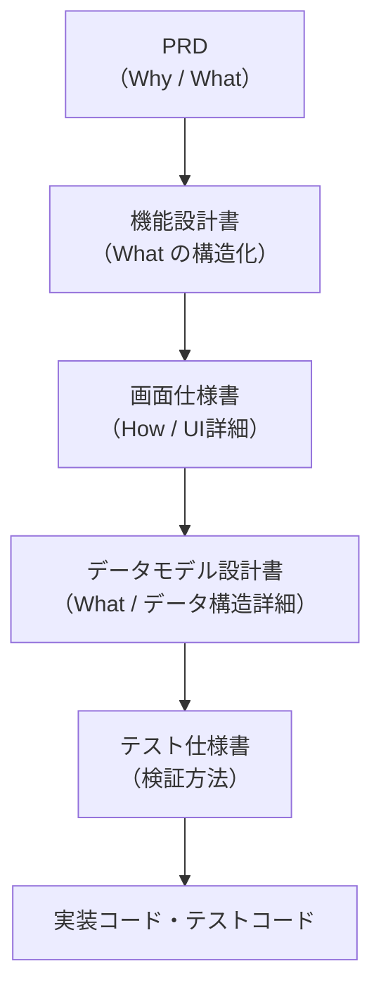

# 2. ドキュメント体系

## 2.1. ドキュメントの二層構造

| 種類 | 配置先 | 性質 |
|---|---|---|
| **永続ドキュメント** | `docs/` | プロダクトの正式な仕様。常に最新を反映する |
| **issue固有ドキュメント** | `.issue/{issue番号}/` | 各issueで実装する変更内容の詳細仕様。issue実装時に参照され、完了後に `docs/` へ反映される |

## 2.2. 永続ドキュメントの階層と責務

プロダクト仕様に関するドキュメントは以下の階層で構成される。
各ドキュメントは明確に異なる責務を持ち、上流から下流へと詳細度が増す。



| ドキュメント | 責務 | 答える問い | 記載する内容 | 記載しない内容 |
|---|---|---|---|---|
| **PRD** | プロダクトの目的と要求の定義 | **なぜ作るか？何を作るか？** | 背景・課題、プロダクトの概要・目的、ターゲットユーザー、KPI・成功指標、機能要求・非機能要求、スコープ外の定義 | 具体的なUI、技術的な実現方法 |
| **機能設計書** | 要求の構造化と画面・機能への分解 | **要求をどんな機能・画面に分割するか？** | 機能一覧とその関係、画面構成（どんな画面が必要か）、機能ごとのユーザーフロー、ドメインモデルの概念（エンティティの存在と関係性） | 各画面の詳細なUI仕様、データモデルの詳細（フィールド定義・型・制約） |
| **データモデル設計書** | データ構造の詳細定義 | **各エンティティの具体的な構造は？** | エンティティのフィールド定義・型・制約、ER図（物理設計）、インターフェース定義、データバリデーションルール | プロダクト全体の目的、UI仕様、永続化方式（ストレージ・バックアップ） |
| **画面仕様書** | 各画面のUI・操作・挙動の詳細定義 | **ユーザーがどう操作し、何が起きるか？** | 画面レイアウト、UI要素の一覧と状態、ユーザー操作時の挙動（クリック・入力・ドラッグ等）、バリデーションルール、エラー表示、画面遷移 | プロダクト全体の目的、機能間の関係性 |
| **テスト仕様書** | 実装の検証方法の定義 | **何をどうテストすれば正しいと言えるか？** | テストケース、テスト観点、期待結果、境界条件 | 実装の詳細、UIデザイン |

### 具体例による責務の違い

「タスク管理機能」を例にした各ドキュメントの記載内容：

| ドキュメント | 記載例 |
|---|---|
| **PRD** | 「ユーザーがプロジェクト内のタスクの進捗を可視化し、チームで共有できること。KPI: タスク完了率の20%向上」 |
| **機能設計書** | 「タスク管理は カンバン(SCR-008)・ガント(SCR-009) の2ビューで構成。タスクにはステータス・担当者・期限の属性を持つ」 |
| **データモデル設計書** | 「Task: { id: string, title: string(max 200), status: 'todo'\|'doing'\|'done', assigneeId: string(FK→User), dueDate: string\|null }。TaskとUserは多対1の関係」 |
| **画面仕様書** | 「カンバン画面: カードをドラッグ&ドロップでステータス変更。ドロップ先が無効な場合は元の位置に戻る。右クリックでコンテキストメニュー（編集・削除・複製）を表示」 |
| **テスト仕様書** | 「カンバンのD&Dテスト: (1) カードをTodo→Doingにドラッグ→ステータスがDoingに変更される (2) 権限なしユーザーがドラッグ→元の位置に戻りエラー表示」 |

### スペック間の依存関係

上流のスペックから下流のスペックが導出され、最終的にコードに至る。
既存の変更・修正においては、上流スペックの変更が下流に波及する。

## 2.3. 横断的ドキュメント

上記の階層に加えて、横断的に参照されるドキュメントがある。
実装時のコンテキスト効率を最大化するため、読み込み戦略で分類する。

### 常時読み込み（グローバルコンテキスト）

すべての実装タスクで必ず読み込む。内容は簡潔に保つ。

| ドキュメント | 役割 |
|---|---|
| アーキテクチャ設計書 | 技術スタック、システム構成の概要 |
| 開発ガイドライン | コーディング規約、開発プロセス |
| リポジトリ構造 | ディレクトリ構成、ファイル配置ルール |
| 用語集 | プロジェクト固有の用語を定義 |

### 選択的読み込み（タスク固有コンテキスト）

実装内容に応じて必要なものだけ読み込む。1関心事 = 1ファイルで独立させる。

| ドキュメント | 役割 | 読み込むタイミング |
|---|---|---|
| デザインパターン | 特定の関心事における設計・実装パターン | 該当する実装タスク時のみ |

### パターンカタログによる読み込み制御

`docs/design-patterns/index.md` に全パターンの一覧と適用条件を記載する。
エージェントはこのカタログを参照し、タスクに必要なパターンファイルのみを読み込む。

```
実装タスク開始
  │
  ├─ 常時読み込み
  │    ├─ architecture.md
  │    ├─ development-guidelines.md
  │    ├─ repository-structure.md
  │    └─ glossary.md
  │
  └─ design-patterns/index.md を参照
       │
       └─ タスクに該当するパターンのみ読み込み
            ├─ ui-components.md（UI構築時）
            ├─ data-fetching.md（データ取得・送信時）
            └─ ...
```

## 2.4. PRDの運用方針

- プロダクト立ち上げ時に一度作成し、1ファイル（`docs/product-requirements.md`）で管理する
- プロダクトに新たな概念を持ち込むとき以外は更新しない
- このファイルだけでプロダクトの概観を理解できる状態を維持する
- 内容はKPIを除き抽象的な記述にとどめる
- 個別機能の追加・改善の要求はPRDではなく機能設計書・画面仕様書に記載する

## 2.5. issueの二層構造

| 層 | 配置先 | 内容 | 詳細度 |
|---|---|---|---|
| **GitHub issue** | GitHub | 簡潔な概要・目的・スコープ | 低（概要レベル。人間が管理・確認するためのインデックス） |
| **issueディレクトリ** | `.issue/{issue番号}/` | 1つのissueのライフサイクル全体に関わるドキュメント | 高（画面仕様書と同等以上。autopilotが参照する主な情報源） |

### issueディレクトリの内容

`.issue/{issue番号}/` は、実装前から実装完了後までの全フェーズのドキュメントを保持する。

| フェーズ | ドキュメント例 | 作成タイミング |
|---|---|---|
| **実装前** | 変更仕様書（差分画面仕様等）、影響範囲分析 | issue登録時 |
| **実装中** | 作業リスト（タスク分解・進捗管理） | autopilot実行時 |
| **実装後** | レビュー結果、品質検証ドキュメント | autopilot実行後 |

## 2.6. 永続ドキュメントの配置先一覧

| ドキュメント | 配置先 |
|---|---|
| アイデアメモ | `docs/ideas/YYYYMMDD-memo.md` |
| PRD | `docs/product-requirements.md` |
| 機能設計書 | `docs/functional-design.md` |
| データモデル設計書 | `docs/data-model/` |
| 画面仕様書 | `docs/screen-specification/` |
| テスト仕様書 | `docs/test-specification/` |
| アーキテクチャ設計書 | `docs/architecture.md` |
| デザインパターン（カタログ） | `docs/design-patterns/index.md` |
| デザインパターン（個別） | `docs/design-patterns/{concern}.md` |
| 開発ガイドライン | `docs/development-guidelines.md` |
| 用語集 | `docs/glossary.md` |
| リポジトリ構造 | `docs/repository-structure.md` |
| 技術選定結果 | `docs/tech-decisions/YYYYMMDD-{topic}.md` |
