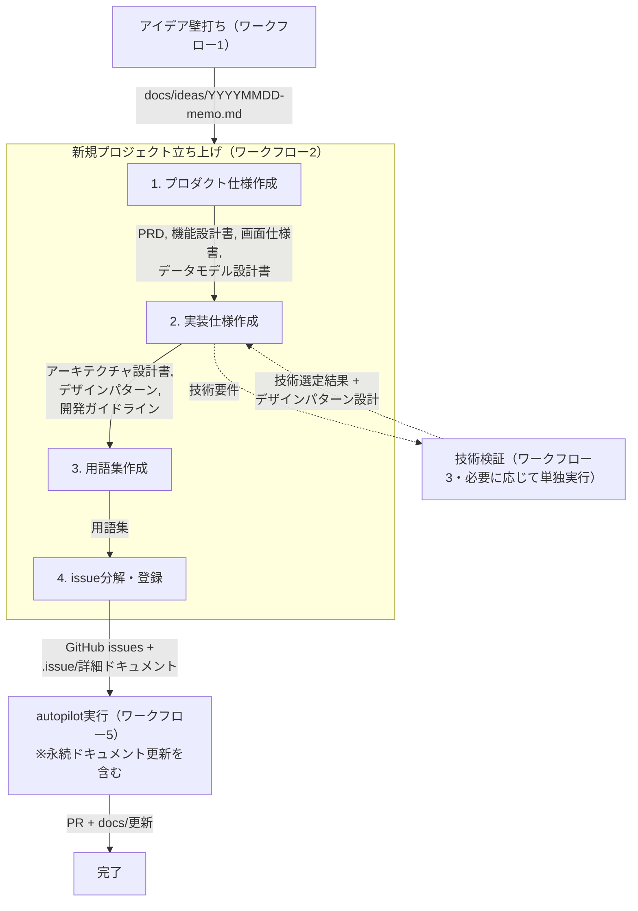
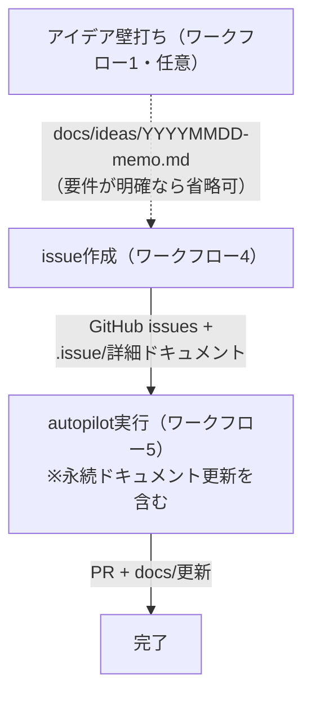
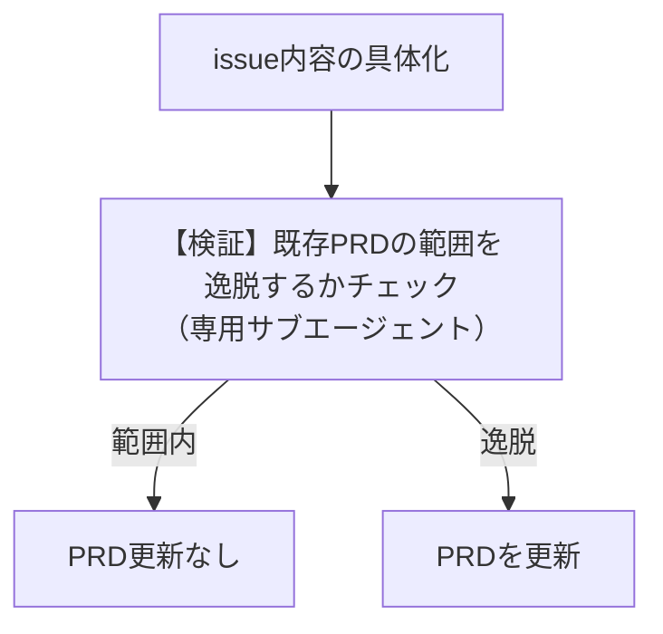

# 3. ユーザーワークフローとプロジェクトライフサイクル

## 3.1. ユーザーが開始するワークフロー一覧

| # | ワークフロー | 対象 | 概要 | 入力 | 出力 |
|---|---|---|---|---|---|
| 1 | **アイデア壁打ち** | 共通 | ユーザーとAIが対話的にアイデアを壁打ち・整理 | ユーザーの構想・課題 | `docs/ideas/YYYYMMDD-memo.md` |
| 2 | **新規プロジェクト立ち上げ** | 新規のみ | プロダクト仕様作成 → 実装仕様作成 → issue分解・登録 を一貫実行 | `docs/ideas/YYYYMMDD-memo.md`（WF1の出力） | GitHub issues + `.issue/` 詳細ドキュメント + 各種仕様書 |
| 3 | **技術検証** | 共通 | 技術候補の調査 → PoC実装・検証 → 技術選定 → デザインパターン設計 | ユーザーの要件（対話的に整理）+ `docs/architecture.md` + `docs/design-patterns/` | `poc/{技術名}/`（検証コード + パターン検証コード）, `docs/tech-decisions/YYYYMMDD-{topic}.md`, `docs/design-patterns/{concern}.md`（新規追加）, `docs/design-patterns/index.md`（カタログ更新） |
| 4 | **issue作成** | 既存のみ | ユーザーとAIが対話的にissueを作成 | ユーザーの要求（対話的に整理）+ `docs/` 配下の既存ドキュメント（参照用） | GitHub issues + `.issue/` 詳細ドキュメント（※詳細構造は後続で確定） |
| 5 | **autopilot実行** | 共通 | issueを自動実行しPRを作成（実装完了時に永続ドキュメントも適宜更新） | GitHub issue + `.issue/{issue番号}/` | PR（issue単位で紐付け）+ `docs/` の更新 |

### ワークフロー内の専門エージェント

「新規プロジェクト立ち上げ」ワークフロー内で使用される専門エージェントは、既存プロジェクトの機能追加時にも再利用される。

```
新規プロジェクト立ち上げ（オーケストレーター）
  ├─ PRD作成エージェント
  ├─ 機能設計エージェント              ←─ 既存PJの機能追加時にも利用可能
  ├─ 画面仕様エージェント              ←─ 既存PJの機能追加時にも利用可能
  ├─ 実装仕様エージェント              ←─ 既存PJの実装仕様変更時にも利用可能
  └─ issue分解・登録エージェント        ←─ 既存PJのissue作成時にも利用可能
```

## 3.2. 新規プロジェクトの場合



### 新規プロジェクト立ち上げの内部ステップ

| ステップ | 概要 | 入力 | 出力 |
|---|---|---|---|
| 1. プロダクト仕様作成 | アイデアメモからプロダクト仕様を生成 | `docs/ideas/YYYYMMDD-memo.md`（WF1の出力） | `docs/product-requirements.md`, `docs/functional-design.md`, `docs/screen-specification/`, `docs/data-model/` |
| 2. 実装仕様作成 | 実装に必要な技術仕様を定義 | `docs/product-requirements.md`, `docs/functional-design.md`, `docs/screen-specification/` | `docs/architecture.md`, `docs/design-patterns/`, `docs/development-guidelines.md`, `docs/repository-structure.md` |
| 3. 用語集作成 | プロダクトで使用する用語を定義 | ステップ1〜2の全出力ドキュメント | `docs/glossary.md` |
| 4. issue分解・登録 | 仕様を適切な粒度に分解しissueとして登録 | `docs/product-requirements.md`, `docs/functional-design.md`, `docs/screen-specification/`, `docs/architecture.md`, `docs/design-patterns/`, `docs/development-guidelines.md`, `docs/repository-structure.md`, `docs/glossary.md` | GitHub issues + `.issue/` 詳細ドキュメント（※詳細構造は後続で確定） |

### issue登録の制約

- issueは依存関係を考慮した適切な順序で登録する
- issue #N を実行するために先に実施すべきissueがある場合、それは #N より小さい番号で登録されていなければならない

## 3.3. 既存プロジェクトの場合



| ステップ | 概要 | 入力 | 出力 |
|---|---|---|---|
| 0. アイデア壁打ち（任意） | ユーザーとAIが対話的にアイデアを壁打ち・整理 | ユーザーの構想・課題 | `docs/ideas/YYYYMMDD-memo.md` |
| 1. issue作成 | ユーザーとAIが対話的にissueを作成 | ユーザーの要求（対話的に整理）+ `docs/` 配下の既存ドキュメント（参照用） | GitHub issues + `.issue/{issue番号}/`（※詳細構造は後続で確定） |
| 2. autopilot実行 | issueを自動実行しPRを作成（永続ドキュメント更新を含む） | GitHub issue + `.issue/{issue番号}/` | PR（issue単位で紐付け）+ `docs/` の更新 |

### issue種別

issue作成ワークフロー（WF4）では、issue種別に応じた詳細ドキュメントをワークフロー内で作成し `.issue/{issue番号}/` に格納する。

| issue種別 | 目的 | ワークフロー内で作成するドキュメント例 |
|---|---|---|
| 機能の追加・変更 | UI変更、操作挙動変更、UI+挙動の追加など | 変更仕様書（差分画面仕様等） |
| 既存の不具合の修正 | バグの再現・原因特定・修正 | 不具合の再現手順・ログ・スクリーンショット等 |
| リファクタリング | コード品質の改善（機能変更なし） | リファクタリング方針・対象範囲 |
| パフォーマンス改善 | 計測結果に基づく最適化 | パフォーマンス計測結果・改善方針 |
| 依存ライブラリ・基盤更新 | ライブラリバージョンアップ、CI/CD変更など | 更新内容・影響範囲・移行手順 |

※ 各種別のドキュメント詳細構造は後続で確定する。

### 既存プロジェクトにおけるPRD更新

新機能の内容が具体化したタイミングで、専用のサブエージェントが既存PRDの範囲を逸脱するかチェックする。


