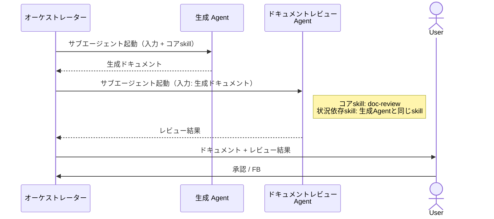
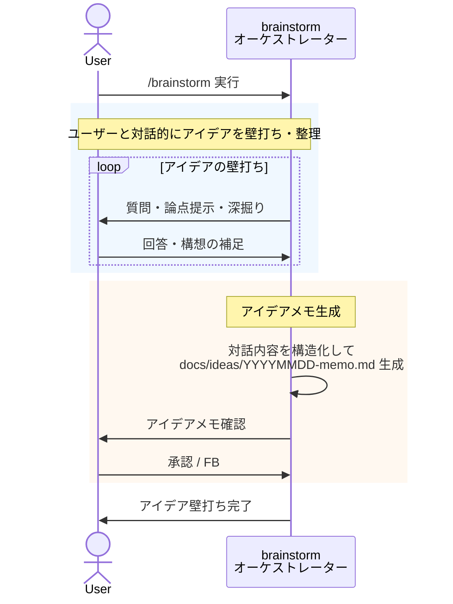
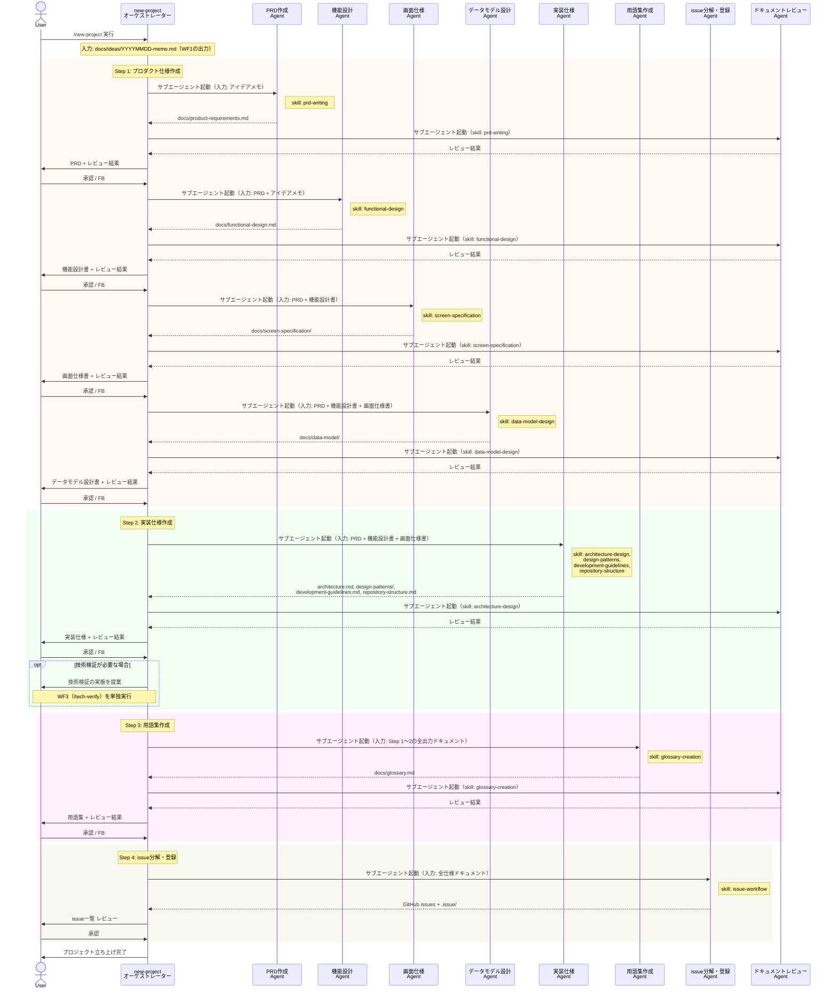
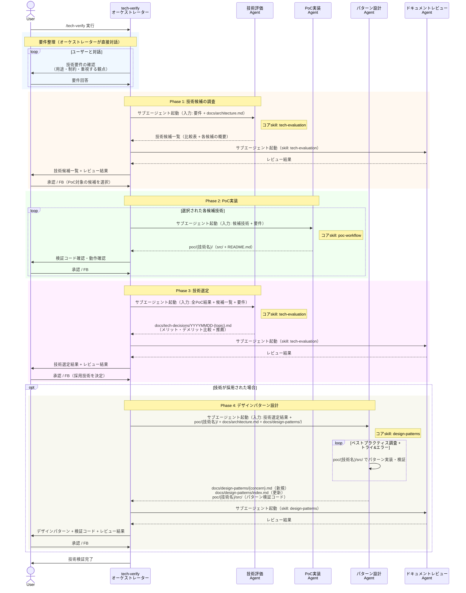
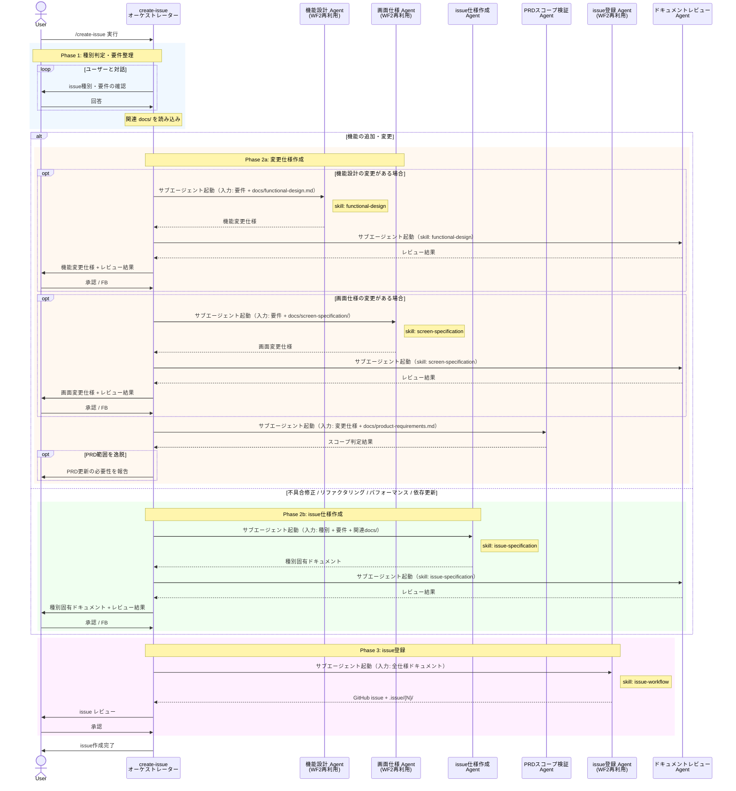
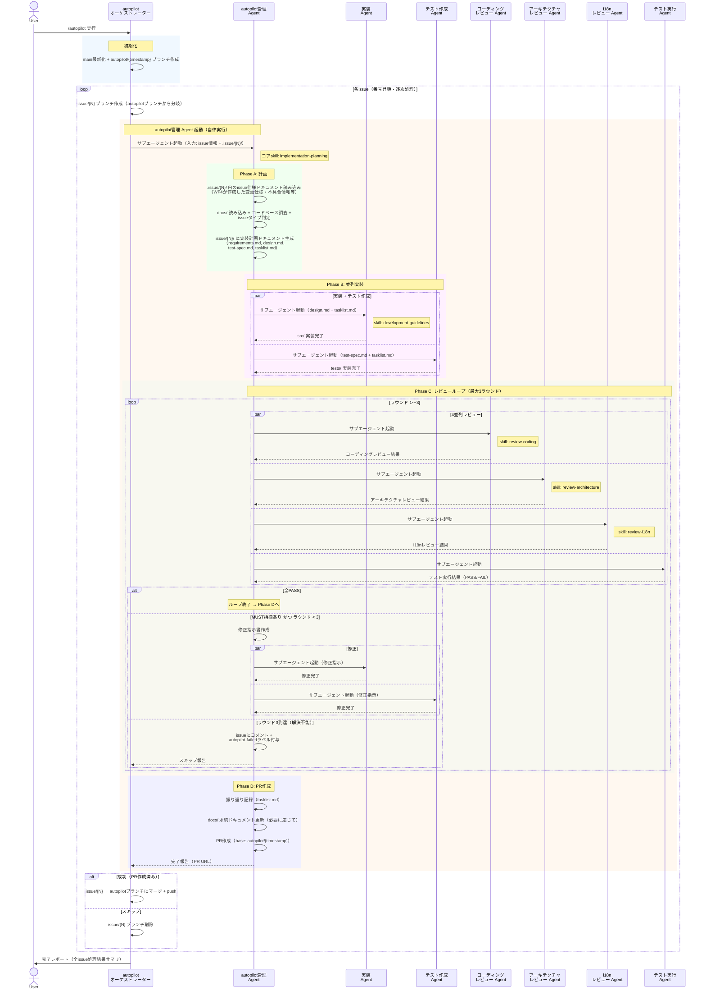

# 6. ワークフロー シーケンス設計

## 6.0. 共通パターン: ドキュメント生成→レビュー→承認

各ワークフローでドキュメントを生成するステップでは、以下の共通パターンを適用する。



### ドキュメントレビュー Agent の仕様

| 項目 | 内容 |
|---|---|
| ファイル名 | `agents/doc-reviewer.md` |
| コアskill | `doc-review`（レビュー方法論・出力フォーマット・重要度分類） |
| 状況依存skill | レビュー対象に対応するskill（例: PRDレビュー時は `prd-writing`） |
| 入力 | レビュー対象ドキュメント |
| 出力 | レビュー結果（指摘事項・重要度分類） |

### 重要度分類

| 分類 | 意味 |
|---|---|
| **MUST** | 修正必須。品質基準を満たしていない |
| **SHOULD** | 修正推奨。品質向上に寄与する |
| **MAY** | 任意。将来的な改善候補 |

### 適用範囲

- **レビュー対象**: 仕様ドキュメント（PRD、機能設計書、画面仕様書、実装仕様、用語集、技術選定結果、デザインパターン、issue仕様）
- **レビュー対象外**: アイデアメモ（非公式な対話成果物）、issue登録（構造的な処理）

---

## 6.1. WF1: アイデア壁打ち

### 参加者

| 種別 | 名前 | ファイル名 | コアskill | 役割 |
|---|---|---|---|---|
| オーケストレーター | アイデア壁打ち | `skills/brainstorm/` | `idea-brainstorming` | ユーザーと対話的にアイデアを壁打ち・整理 |

### シーケンス図



### 設計ポイント

1. **Skill直接実行（Agentなし）**: ユーザーとの対話が本質のため、設計原則 4.4 に基づきSkillとしてメイン会話で実行する。サブエージェントは起動しない
2. **コンテキスト分離**: 独立ワークフローとすることで、壁打ちの大量のやり取りが後続WF（WF2等）のコンテキストを圧迫しない
3. **レビュー対象外**: アイデアメモは非公式な対話成果物のため、ドキュメントレビューAgentの検証対象外とする
4. **新規・既存共通**: 新規プロジェクト（WF2の前段）でも既存プロジェクト（WF4の前段）でも利用可能

---

## 6.2. WF2: 新規プロジェクト立ち上げ

### 参加者

| 種別 | 名前 | ファイル名 | コアskill | 役割 |
|---|---|---|---|---|
| オーケストレーター | 新規PJ立ち上げ | `skills/new-project/` | — | 全ステップの順序制御・ユーザー承認ゲート管理 |
| エージェント | PRD作成 | `agents/prd-writer.md` | `prd-writing` | PRDを生成 |
| エージェント | 機能設計 | `agents/functional-designer.md` | `functional-design` | 機能設計書を生成 |
| エージェント | 画面仕様 | `agents/screen-spec-writer.md` | `screen-specification` | 画面仕様書を生成 |
| エージェント | データモデル設計 | `agents/data-model-designer.md` | `data-model-design` | データモデル設計書を生成 |
| エージェント | 実装仕様 | `agents/implementation-spec-writer.md` | `architecture-design` | アーキテクチャ・ガイドライン等を生成 |
| エージェント | 用語集作成 | `agents/glossary-creator.md` | `glossary-creation` | 用語集を生成 |
| エージェント | issue分解・登録 | `agents/issue-decomposer.md` | `issue-workflow` | 仕様をissueに分解しGitHubに登録 |
| エージェント | ドキュメントレビュー | `agents/doc-reviewer.md` | `doc-review` | 生成ドキュメントの品質検証（共通パターン 6.0 参照） |

### シーケンス図



### 設計ポイント

1. **二重レビュー**: 各ドキュメント生成後、レビューAgentによる品質検証とユーザーレビューの二重ゲートを設ける（共通パターン 6.0）。レビューAgentは生成Agentと同じskillを読み込み、定義された品質基準に基づいて検証する
2. **WF1 依存**: アイデアメモ（`docs/ideas/YYYYMMDD-memo.md`）をWF1から受け取る。アイデアの壁打ちはコンテキスト分離のため独立WFとして切り出されている
3. **Step 1 の内部順序**: PRD → 機能設計書 → 画面仕様書 → データモデル設計書 は上流から下流への依存関係があるため、順次実行する。データモデルは画面仕様のUX要件を反映するため、画面仕様の後に作成する
4. **エージェントの独立性**: 各エージェントは独立したコンテキストで動作し、必要な入力のみを受け取る。これによりコンテキスト肥大化を防ぐ
5. **WF3 との連携**: Step 2 で技術検証が必要な場合、オーケストレーターが WF3 の実行を提案する。WF3 は独立ワークフローとして単独実行される
6. **エージェント再利用**: 機能設計・画面仕様・issue分解・登録エージェントは WF4 でも再利用される

---

## 6.3. WF3: 技術検証

### 参加者

| 種別 | 名前 | ファイル名 | コアskill | 役割 |
|---|---|---|---|---|
| オーケストレーター | 技術検証 | `skills/tech-verify/` | — | 要件整理（対話）・承認ゲート管理 |
| エージェント | 技術評価 | `agents/tech-evaluator.md` | `tech-evaluation` | 技術候補の調査・比較（Phase 1）、PoC結果を踏まえた評価・推薦（Phase 3） |
| エージェント | PoC実装 | `agents/poc-implementer.md` | `poc-workflow` | PoCディレクトリで検証コードを実装 |
| エージェント | パターン設計 | `agents/pattern-designer.md` | `design-patterns` | PoCディレクトリでベストプラクティスとトライ&エラーを通じたデザインパターン設計 |
| エージェント | ドキュメントレビュー | `agents/doc-reviewer.md` | `doc-review` | 生成ドキュメントの品質検証（共通パターン 6.0 参照） |

### シーケンス図



### 設計ポイント

1. **二重レビュー**: 各フェーズのドキュメント生成後、レビューAgentによる品質検証とユーザーレビューの二重ゲートを設ける（共通パターン 6.0）
2. **4フェーズ分離**: 候補調査→PoC実装→技術選定→パターン設計の4段階。各段階で異なる関心事に集中し、前段階の結果を踏まえた判断を可能にする
3. **PoC実装による実証**: Phase 2で`poc/{技術名}/`に実際のソースコードを生成し、理論的な比較だけでなく実動作に基づいた技術評価を可能にする
4. **技術評価エージェントの二段階利用**: 同一エージェントをPhase 1（広く浅い候補比較）とPhase 3（PoC結果に基づく深い評価）で二度起動する。入力が異なるため、各フェーズに適したコンテキストで動作する
5. **不採用時の早期終了**: Phase 3で不採用が決定した場合、Phase 4（デザインパターン設計）はスキップされる
6. **トライ&エラーによるパターン設計**: Phase 4のパターン設計エージェントは`poc/{技術名}/`ディレクトリで実際にパターンを実装・検証し、ベストプラクティスの調査と試行錯誤を通じて最適なパターンを決定する
7. **要件整理はオーケストレーター直接**: ユーザーとの対話が中心のため、agentを介さずskillが直接行う（設計原則 4.4 に基づく）
8. **カタログ自動更新**: 新パターン作成時に`index.md`も同時に更新し、選択的読み込みの仕組みを維持する
9. **Phase 2はドキュメントレビュー対象外**: PoCコードは使い捨ての検証コードであり、品質基準に基づくドキュメントレビューの対象外。ユーザーが直接動作確認する

---

## 6.4. WF4: issue作成

### 参加者

| 種別 | 名前 | ファイル名 | コアskill | 役割 | 備考 |
|---|---|---|---|---|---|
| オーケストレーター | issue作成 | `skills/create-issue/` | — | 種別判定・要件整理（対話）・承認ゲート管理 | |
| エージェント | 機能設計 | `agents/functional-designer.md` | `functional-design` | 機能変更仕様を作成 | WF2再利用 |
| エージェント | 画面仕様 | `agents/screen-spec-writer.md` | `screen-specification` | 画面変更仕様を作成 | WF2再利用 |
| エージェント | issue仕様作成 | `agents/issue-spec-writer.md` | `issue-specification` | 種別固有ドキュメントを作成 | 新規 |
| エージェント | PRDスコープ検証 | `agents/prd-scope-checker.md` | — | 変更がPRD範囲を逸脱するか検証 | 新規 |
| エージェント | issue登録 | `agents/issue-decomposer.md` | `issue-workflow` | GitHub issue + .issue/ を作成 | WF2再利用（登録モード） |
| エージェント | ドキュメントレビュー | `agents/doc-reviewer.md` | `doc-review` | 生成ドキュメントの品質検証（共通パターン 6.0 参照） | WF2再利用 |

### シーケンス図



### 設計ポイント

1. **二重レビュー**: 各ドキュメント生成後、レビューAgentによる品質検証とユーザーレビューの二重ゲートを設ける（共通パターン 6.0）
2. **種別による分岐**: 「機能追加・変更」はWF2のエージェントを再利用して変更仕様を作成。他の4種別は専用のissue仕様作成エージェントが種別固有ドキュメントを作成する
3. **エージェントの二面性**: 機能設計・画面仕様エージェントはWF2では新規作成、WF4では差分仕様作成として動作する。オーケストレーターが動作モード（新規/変更）と入力を制御する
4. **条件付き呼出**: 機能追加でも、変更内容に応じて機能設計エージェント・画面仕様エージェントを選択的に起動する（UIのみの変更なら画面仕様のみ、等）
5. **PRDスコープ検証**: 機能追加・変更時のみ実施。PRDの範囲を逸脱する場合はユーザーに報告し、PRD更新の判断を委ねる
6. **issue登録はレビュー対象外**: issue登録は構造的な処理のため、ドキュメントレビューの対象外とする

---

## 6.5. WF5: autopilot実行

### 参加者

| 種別 | 名前 | ファイル名 | コアskill | 役割 |
|---|---|---|---|---|
| オーケストレーター | autopilot入口 | `skills/autopilot/` | — | バッチ処理制御・ブランチ管理・完了レポート |
| エージェント | autopilot管理 | `agents/autopilot-manager.md` | `implementation-planning` | issue単位の計画→実装→レビュー→PR作成を自律管理 |
| エージェント | 実装 | `agents/implementer.md` | `development-guidelines` | 本番コード（src/）の実装・修正 |
| エージェント | テスト作成 | `agents/test-writer.md` | — | テストコード（tests/）の実装・修正 |
| エージェント | コーディングレビュー | `agents/coding-reviewer.md` | `review-coding` | コーディング規約準拠の検証 |
| エージェント | アーキテクチャレビュー | `agents/architecture-reviewer.md` | `review-architecture` | アーキテクチャ準拠の検証 |
| エージェント | i18nレビュー | `agents/i18n-reviewer.md` | `review-i18n` | 多言語対応の検証 |
| エージェント | テスト実行 | `agents/test-runner.md` | — | テスト・リント・型チェック・ビルドの実行 |

### WF5の構造的特徴

WF5は他のWFと異なり**二段階オーケストレーション**を持つ（設計原則 4.4 参照）:

```
User → skill(autopilot入口) → agent(autopilot管理) → Agent(s) → 成果物
         バッチ処理制御          issue単位の自律実行
```

- **autopilot入口（Skill）**: バッチ処理の制御、ブランチ管理、結果レポート
- **autopilot管理（Agent）**: 1つのissueに対するPhase A〜Dの全フローを自律的に実行

### シーケンス図



### 設計ポイント

1. **二段階オーケストレーション**: entry skill（バッチ処理制御）→ autopilot管理Agent（issue単位の自律実行）の二層構造。設計原則 4.4 に基づき、ユーザー対話不要の自律実行部分をAgentとする
2. **完全自律実行**: WF1〜4と異なり、ユーザーの承認ゲートを持たない。Phase A〜Dまで自動実行し、エラー時はissueにコメント + failedラベルで通知する
3. **並列実装（Phase B）**: 実装AgentとテストAgentを並列起動。実装Agentはsrc/のみ、テストAgentはtests/のみを編集するため競合しない
4. **並列レビュー（Phase C）**: コーディング・アーキテクチャ・i18n・テスト実行の4種のレビューを並列実行。各レビューは独立した観点で評価する
5. **修正サイクル上限**: レビューループは最大3ラウンド。MUST指摘がなくなるまで修正→再レビューを繰り返す。3ラウンドで解決不能な場合はautopilot-failedラベルを付けてスキップ
6. **ドキュメント駆動のエージェント間通信**: エージェント間の情報伝達はすべて`.issue/{N}/`配下のドキュメントを介して行う。Agentのプロンプトにはドキュメントパスを渡し、Agent自身がファイルを読み取る
7. **逐次issue処理**: issueは番号昇順で逐次処理。前のissueがautopilotブランチにマージされた状態から次のissueを開始し、issue間の依存関係を保証する
8. **autopilotブランチ戦略**: 各issueのPRはmainではなくautopilotブランチをベースに作成。前issueの変更が次issueに反映された状態で開発できる
9. **共通パターン（6.0）は不適用**: WF5のレビューはコードレビュー（Phase C）であり、ドキュメントレビュー（6.0）とは目的・手法が異なる。MUST/SHOULD/MAY分類は共通するが、レビュー対象と判定基準が異なる
10. **バッチ間コンテキスト管理**: 複数issueを処理する際、バッチ完了ごとにコンテキストを圧縮し、次のバッチの処理品質を維持する
