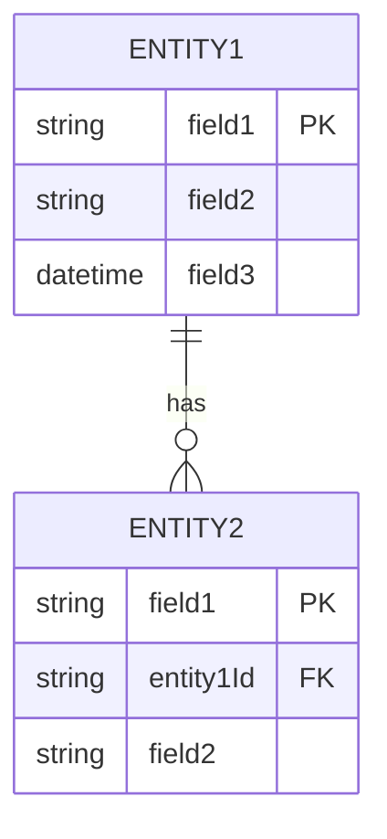

# データモデル設計書 (Data Model Design Document)

> 作成日: [YYYY-MM-DD]
> 対象フェーズ: [フェーズ名]
> 対応機能設計書: docs/functional-design.md

---

## エンティティ一覧

機能設計書のドメインモデルから導出されたエンティティの一覧。

| エンティティ | 説明 | ドメインモデル上の対応 |
|---|---|---|
| [エンティティ1] | [このエンティティが表すもの] | [機能設計書のどの概念に対応するか] |
| [エンティティ2] | [このエンティティが表すもの] | [機能設計書のどの概念に対応するか] |

---

## エンティティ定義

### [エンティティ1]

```typescript
interface EntityName {
  field1: string;   // 説明
  field2: number;   // 説明
}
```

**フィールド定義**:

| フィールド | 型 | 必須 | 制約 | 説明 |
|---|---|---|---|---|
| field1 | string | Yes | 最大100文字 | [説明] |
| field2 | number | Yes | 1以上 | [説明] |

---

### [エンティティ2]

```typescript
interface EntityName {
  field1: string;
  field2: string;
}
```

**フィールド定義**:

| フィールド | 型 | 必須 | 制約 | 説明 |
|---|---|---|---|---|
| field1 | string | Yes | UUID形式 | [説明] |
| field2 | string | Yes | FK→[参照先] | [説明] |

---

## ER図



---

## バリデーションルール

### [エンティティ1]

| ルール | 対象フィールド | 条件 | エラー時の扱い |
|---|---|---|---|
| [ルール名] | field1 | [具体的な条件] | [どうなるか] |
| [ルール名] | field2 | [具体的な条件] | [どうなるか] |

---

## シリアライズ形式（該当する場合）

データの保存・転送時のフォーマットを定義する。

### [形式名]（例: flow.json）

```json
{
  "field1": "value",
  "field2": 123
}
```

**備考**:
- [シリアライズ時の注意点やルール]

---

## 機能設計書ドメインモデルとの対応確認

| 機能設計書のエンティティ | データモデルのエンティティ | 備考 |
|---|---|---|
| [概念名1] | [エンティティ1] | - |
| [概念名2] | [エンティティ2], [エンティティ3] | 概念を2つに分割 |

---

## 将来フェーズへの備考（該当する場合）

| フェーズ | 追加・変更予定のエンティティ | 現フェーズでの考慮点 |
|---|---|---|
| [フェーズ名] | [エンティティ概要] | [現時点で意識しておくべきこと] |
