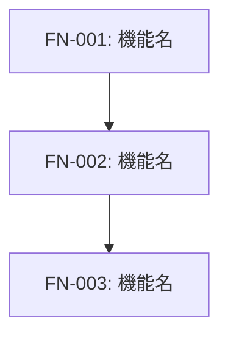
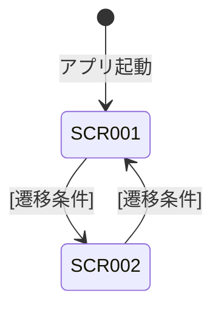
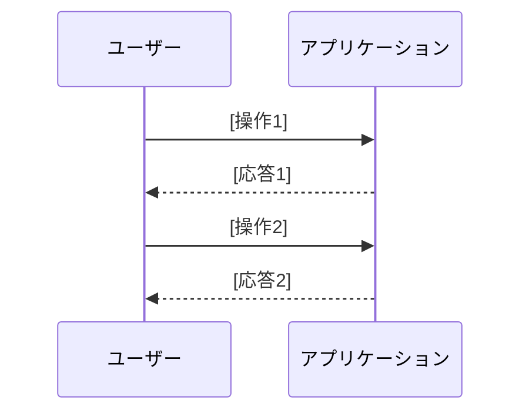

# 機能設計書 (Functional Design Document)

> 作成日: [YYYY-MM-DD]
> 対象フェーズ: [フェーズ名]
> 対応PRD: docs/product-requirements.md

---

## 機能一覧

PRDの要求を具体的な機能に分解し、一覧化する。

| 機能ID | 機能名 | 説明 | 対応するPRD要件 |
|---|---|---|---|
| FN-001 | [機能名] | [この機能が何をするか] | [PRDの要件ID or 要件概要] |
| FN-002 | [機能名] | [この機能が何をするか] | [PRDの要件ID or 要件概要] |

### 機能間の関係



### 機能詳細

#### FN-001: [機能名]

**概要**: [この機能が提供する価値・目的]

**含まれるサブ機能**:
- [サブ機能1]: [説明]
- [サブ機能2]: [説明]

**入力と出力**:
- 入力: [ユーザーまたはシステムから何を受け取るか]
- 出力: [何を生み出すか・何が変わるか]

**ビジネスルール**:
- [ルール1]
- [ルール2]

---

## ドメインモデル（概念レベル）

このアプリケーションに登場する主要な概念（エンティティ）と、それらの関係を示す。

> **注意**: ここでは概念レベルの関係性のみを記載する。各エンティティの具体的なフィールド定義・型・制約は、データモデル設計書で定義する。

```mermaid
erDiagram
    ENTITY1 ||--o{ ENTITY2 : "has"
    ENTITY2 }o--|| ENTITY3 : "belongs to"

    ENTITY1 { summary "説明" }
    ENTITY2 { summary "説明" }
    ENTITY3 { summary "説明" }
```

| エンティティ | 説明 | 主な関係 |
|---|---|---|
| [エンティティ1] | [このエンティティが表す概念] | [エンティティ2]を複数持つ |
| [エンティティ2] | [このエンティティが表す概念] | [エンティティ1]に属する |

---

## 画面構成

### 画面一覧

| 画面ID | 画面名 | 説明 | 主な機能 |
|---|---|---|---|
| SCR-001 | [画面名] | [この画面の目的] | FN-001, FN-002 |
| SCR-002 | [画面名] | [この画面の目的] | FN-003 |

### 画面遷移図



### 画面レイアウト（概要）

> **注意**: ここでは「だいたいこんなアプリ」が伝わる概要レベルのレイアウトを示す。各画面の全UI要素定義、状態別ワイヤーフレーム、操作挙動の詳細は `docs/screen-specification/` で定義する。

#### SCR-001: [画面名]

```
+--------------------------------------------------+
|  [ヘッダー]                                       |
+--------------------------------------------------+
|  [メインコンテンツの概要]                          |
+--------------------------------------------------+
```

---

## ユーザーフロー

主要な機能について、ユーザーがどのように操作するかを概要レベルで示す。

### UF-1: [フロー名]

**概要**: [このフローで達成されること]



**フロー説明**:

1. [ステップ1]
2. [ステップ2]
3. [ステップ3]

---

## 機能カタログ（該当する場合）

特定のドメインにおいて、提供する機能の具体的なバリエーションを一覧化する。
（例: ノードベースエディタのノード種別一覧、レポートの種類一覧など）

| カテゴリ | 種別 | 説明 |
|---|---|---|
| [カテゴリ1] | [種別1] | [説明] |
| [カテゴリ1] | [種別2] | [説明] |

---

## PRD機能要件との対応確認

| PRD機能要件 | 対応する機能 / 画面 |
|---|---|
| [PRDの要件1] | FN-001 / SCR-001 |
| [PRDの要件2] | FN-002 / SCR-002 |

---

## 将来フェーズへの備考（該当する場合）

| フェーズ | 追加予定の機能 | 現フェーズでの考慮点 |
|---|---|---|
| [フェーズ名] | [機能概要] | [現時点で意識しておくべきこと] |
