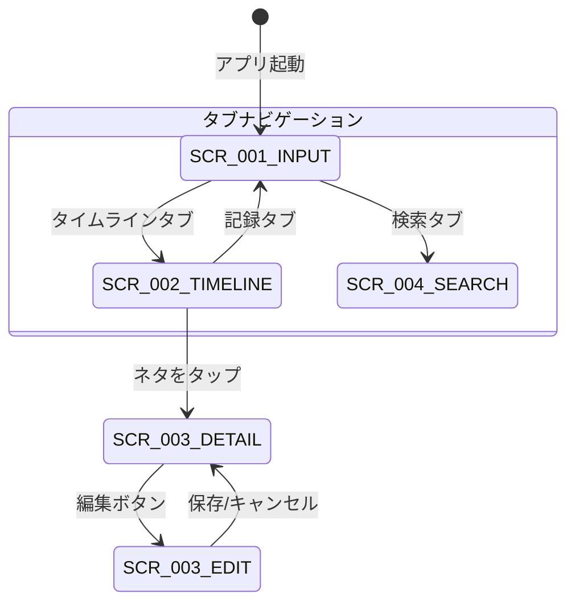

# 画面仕様書作成ガイド

このガイドは、PRD・機能設計書・steeringファイルに基づいて、画面仕様書を作成するための実践的な指針を提供します。

## 画面仕様書の目的

画面仕様書は、実装が進んだ段階で、各画面の**詳細なレイアウトと操作挙動**を定義するドキュメントです。

**主な内容**:

- 画面一覧と画面遷移図
- 各画面のASCIIワイヤーフレーム（状態別）
- 各画面のMarkdownワイヤーフレーム（UI要素の詳細定義）
- 画面操作時のアプリ挙動仕様
- 共通コンポーネント仕様

**段階的UI設計における位置づけ**:

| 段階            | ドキュメント                | 粒度                                                     | タイミング         |
| --------------- | --------------------------- | -------------------------------------------------------- | ------------------ |
| 1. 要求定義     | PRD                         | 「何が欲しいか」（ユーザーストーリー）                   | プロジェクト開始時 |
| 2. 機能設計     | functional-design.md        | 「だいたいこんなUI」（概要レイアウト、画面遷移の全体像） | setup-project時    |
| 3. **画面仕様** | **screen-specification/**   | **「全UI要素の定義、全操作の挙動」**                     | **実装が進んだ後** |

## 入力ドキュメントの読み込み方

### functional-design.md から引き継ぐ情報

functional-design.mdの概要UI設計が画面仕様書の**出発点**になります:

- **画面一覧（View一覧表）**: どの画面が存在するか
- **画面遷移図（stateDiagram）**: 画面間のナビゲーション構造
- **概要レベルのASCIIワイヤーフレーム**: 大まかなレイアウト
- **タブ構成**: メインナビゲーション構造
- **カラーコーディング**: 色の使い分けルール

これらを画面仕様書で**詳細化**します。概要ワイヤーフレームに描かれていなかった要素（状態表示、エラーメッセージ、ローディング等）を追加し、全UI要素の挙動を定義します。

### PRD（product-requirements.md）から読み取る情報

- **機能要件一覧**: 各機能のユーザーストーリーと受け入れ条件
- **優先度**: P0（MVP）/ P1 / P2 の分類
- **非機能要件**: パフォーマンス・ユーザビリティの基準
- **ターゲットユーザー**: ペルソナと典型的なワークフロー

### steeringファイルから読み取る情報

steeringファイルは**時系列順（日付昇順）**に読み込みます。

**読み込む目的**:

1. 実際に実装された画面の最新状態を把握する
2. 初期設計（functional-design.md）からの変更点を理解する
3. 後のsteeringで変更・削除された機能を除外する

**各ファイルから読み取る内容**:

- `requirements.md`: 実装した機能の要求内容
- `design.md`: UIの具体的な設計判断（レイアウト変更、操作フロー変更など）
- `tasklist.md`: 振り返りセクションから実装結果と計画との差分

**注意**: steeringファイル1で「ボタンAを画面上部に配置」と定義し、steeringファイル2で「ボタンAを画面下部に移動」と変更されていた場合、最終的な仕様は「画面下部」です。

## 画面一覧の整理方法

### 画面IDの命名規則

```
SCR-[番号]-[画面名の英語略称]
```

例:

- `SCR-001-INPUT` - 入力画面
- `SCR-002-TIMELINE` - タイムライン画面
- `SCR-003-DETAIL` - ネタ詳細画面
- `SCR-004-SEARCH` - 検索画面

### 画面の分類

| 分類               | 説明                               | 例                             |
| ------------------ | ---------------------------------- | ------------------------------ |
| メイン画面         | タブバーから直接アクセスする画面   | 入力画面、タイムライン         |
| サブ画面           | メイン画面から遷移する画面         | 詳細画面、編集画面             |
| モーダル           | 画面上にオーバーレイ表示される画面 | カメラ、フォトピッカー         |
| システムダイアログ | OS標準のダイアログ                 | 権限リクエスト、確認ダイアログ |

## ASCIIワイヤーフレームの書き方

### 概要レベル（functional-design.md）との違い

|      | functional-design.md | screen-specification/         |
| ---- | -------------------- | ----------------------------- |
| 状態 | 代表的な1状態のみ    | 初期/入力中/空/エラー等を網羅 |
| 要素 | 主要な要素のみ       | 全UI要素を記載                |
| 注釈 | 簡潔な説明           | 要素番号と詳細説明            |

### 基本ルール

1. **罫線文字を使用**: `┌ ┐ └ ┘ ├ ┤ ┬ ┴ ┼ ─ │` で枠線を描画
2. **画面幅の統一**: 全画面のASCIIワイヤーフレームは同じ幅（30〜40文字）で統一
3. **日本語は全角幅で計算**: 日本語1文字 = 半角2文字分
4. **省略記号**: 内容を省略する場合は `...` を使用
5. **アイコン表現**: 必要に応じて絵文字を使用（`📷` `🎤` `✕` 等）
6. **コメント**: ASCII図の右側に `←` でコメントを記述

### 構成要素の表現方法

#### ステータスバー・ナビゲーションバー

```
┌──────────────────────────────┐
│ [←] タイトル          [操作]  │  ← ナビゲーションバー
├──────────────────────────────┤
```

#### テキスト入力フィールド

```
│  ┌──────────────────────┐   │
│  │ プレースホルダーテキスト │   │
│  │                      │   │
│  └──────────────────────┘   │
```

#### ボタン

```
│  ┌──────┐ ┌──────┐ ┌──────┐ │
│  │ ラベル │ │ ラベル │ │ ラベル │ │
│  └──────┘ └──────┘ └──────┘ │
```

#### リスト項目

```
│ ┌────────────────────────┐  │
│ │ [タイトル]       日付   │  │
│ │ 本文プレビュー...       │  │
│ │ [#タグ1] [#タグ2]      │  │
│ └────────────────────────┘  │
│ ┌────────────────────────┐  │
│ │ [タイトル]       日付   │  │
│ │ ...                    │  │
│ └────────────────────────┘  │
```

#### タブバー

```
├──────────────────────────────┤
│  [記録]  [TL]  [検索]  [設定] │  ← タブバー
└──────────────────────────────┘
```

### 状態別のワイヤーフレーム

各画面は以下の状態ごとにASCIIワイヤーフレームを作成します:

| 状態             | 説明                               | 記述が必要な場面         |
| ---------------- | ---------------------------------- | ------------------------ |
| **初期状態**     | 画面を開いた直後                   | 全画面で必須             |
| **入力中**       | ユーザーがデータを入力している途中 | 入力フィールドがある画面 |
| **データあり**   | データが表示されている状態         | 一覧画面、詳細画面       |
| **空状態**       | データが0件の場合                  | 一覧画面                 |
| **エラー状態**   | エラーが発生した場合               | 必要に応じて             |
| **ローディング** | データ取得中                       | 非同期処理がある画面     |

## Markdownワイヤーフレーム（UI要素定義表）の書き方

ASCIIワイヤーフレームの各要素を表形式で詳細定義します。

### 表のフォーマット

```markdown
| #   | 要素名       | 種類               | 説明               | 初期値   | 制約                                        |
| --- | ------------ | ------------------ | ------------------ | -------- | ------------------------------------------- |
| 1   | タイトルバー | ナビゲーションバー | 画面タイトルを表示 | "画面名" | -                                           |
| 2   | テキスト入力 | TextEditor         | 本文テキストの入力 | 空文字   | 最大10000文字                               |
| 3   | 保存ボタン   | Button             | ネタを保存する     | 非活性   | テキストまたは写真が1つ以上ある場合に活性化 |
```

### 要素の種類（GUIアプリの場合）

#### ナビゲーション・レイアウト

| 種類            | 説明                         | 例                                     |
| --------------- | ---------------------------- | -------------------------------------- |
| `NavigationBar` | 画面上部のナビゲーション     | タイトル、戻るボタン、アクションボタン |
| `TabBar`        | 画面下部のタブ切り替え       | メインナビゲーション                   |
| `Toolbar`       | 画面上部/下部のツールバー    | 編集ツール、書式設定                   |
| `Breadcrumb`    | 階層パスの表示               | 設定 > 通知 > 頻度                     |
| `Sidebar`       | サイドメニュー               | iPad用ナビゲーション                   |
| `Card`          | 情報をグループ化するコンテナ | ネタカード、設定項目グループ           |
| `Separator`     | セクション間の区切り線       | リスト内のセクション区切り             |
| `Accordion`     | 折りたたみ可能なセクション   | FAQ、設定カテゴリ                      |
| `Tabs`          | コンテンツ切替用のタブ       | セグメントコントロール、フィルタタブ   |
| `Carousel`      | 横スワイプで切り替えるビュー | 写真ギャラリー、オンボーディング       |

#### 入力

| 種類          | 説明                         | 例                        |
| ------------- | ---------------------------- | ------------------------- |
| `Button`      | タップ可能なボタン           | 保存、削除、キャンセル    |
| `IconButton`  | アイコンのみのボタン         | 閉じる(✕)、共有、編集     |
| `TextField`   | 単一行テキスト入力           | 検索バー、タイトル入力    |
| `TextEditor`  | 複数行テキスト入力           | 本文入力、メモ            |
| `Toggle`      | ON/OFFスイッチ               | 設定項目、通知のオン/オフ |
| `Checkbox`    | チェックボックス             | 複数選択、TODO            |
| `RadioGroup`  | 排他選択のラジオボタン群     | カテゴリ選択（1つのみ）   |
| `Picker`      | ドラム式/ドロップダウン選択  | カテゴリ選択、ソート順    |
| `Select`      | ドロップダウン形式の選択     | プルダウンメニュー        |
| `DatePicker`  | 日付・時刻の選択             | 期限設定、日付フィルタ    |
| `Slider`      | 範囲値のスライダー           | 音量、フォントサイズ      |
| `Stepper`     | 数値の増減ボタン             | 件数、回数の設定          |
| `SearchField` | 検索専用のテキスト入力       | フリーワード検索          |
| `Form`        | 入力項目のグループ化コンテナ | 設定画面、編集フォーム    |

#### 表示

| 種類          | 説明                               | 例                                 |
| ------------- | ---------------------------------- | ---------------------------------- |
| `Label`       | 読み取り専用テキスト               | 日付、カテゴリ名                   |
| `Badge`       | 小さなステータスラベル             | 未読件数、NEW表示                  |
| `Chip`        | タグチップ（タップ可能）           | タグ表示、フィルタ条件             |
| `Avatar`      | ユーザー/アイテムのアイコン画像    | プロフィール画像、カテゴリアイコン |
| `Image`       | 画像表示                           | サムネイル、フル画像               |
| `AspectRatio` | アスペクト比を固定した画像コンテナ | 写真プレビュー（4:3, 1:1等）       |
| `Table`       | 行列形式のデータ表示               | 統計テーブル、比較表               |
| `Skeleton`    | データ読み込み中のプレースホルダー | カード/リストのローディング状態    |
| `EmptyState`  | データが0件の時の案内表示          | 「まだネタがありません」           |

#### リスト・スクロール

| 種類         | 説明                   | 例                     |
| ------------ | ---------------------- | ---------------------- |
| `List`       | スクロール可能なリスト | タイムライン           |
| `ScrollView` | スクロールビュー       | 横スクロール写真一覧   |
| `LazyGrid`   | グリッドレイアウト     | 写真一覧、カテゴリ一覧 |
| `Pagination` | ページ送りUI           | ページ番号、もっと見る |

#### フィードバック・オーバーレイ

| 種類                | 説明                               | 例                                   |
| ------------------- | ---------------------------------- | ------------------------------------ |
| `Alert`             | アラートダイアログ                 | エラー表示、確認ダイアログ           |
| `ConfirmDialog`     | 確認付きダイアログ（破壊的操作用） | 削除確認「本当に削除しますか？」     |
| `Sheet`             | ボトムシート / ハーフモーダル      | カメラ、フォトピッカー、詳細メニュー |
| `Popover`           | 要素に紐づくポップオーバー         | ツールチップ的な補足情報             |
| `ContextMenu`       | ロングプレスで表示するメニュー     | コピー、共有、削除                   |
| `DropdownMenu`      | タップで展開するメニュー           | ソート順選択、その他の操作           |
| `Toast`             | 一時的なフィードバック通知         | 「保存しました」「コピーしました」   |
| `ProgressIndicator` | ローディング表示（不定）           | スピナー、インジケーター             |
| `ProgressBar`       | 進捗表示（確定）                   | アップロード進捗、処理進捗           |
| `HoverCard`         | ホバー/タップで表示する情報カード  | 要素の詳細プレビュー                 |

## 操作挙動仕様の書き方

### フォーマット

各画面の操作挙動は以下の形式で定義します:

```markdown
### 操作: [操作名]

**トリガー**: [ユーザーのアクション]
**前提条件**: [操作が有効な条件]

**正常系の挙動**:

1. [ステップ1]
2. [ステップ2]
3. [ステップ3]

**異常系の挙動**:

| 条件        | 挙動           |
| ----------- | -------------- |
| [異常条件1] | [対応する挙動] |
| [異常条件2] | [対応する挙動] |

**画面遷移**: [遷移先の画面ID、または「遷移なし」]
**状態変化**: [画面の状態がどう変わるか]
```

### トリガーの種類

| トリガー               | 説明                               | 例                             |
| ---------------------- | ---------------------------------- | ------------------------------ |
| `タップ`               | 要素を1回タップ                    | ボタンタップ、リスト項目タップ |
| `ロングプレス`         | 要素を長押し                       | コンテキストメニュー表示       |
| `スワイプ`             | 指をスライド                       | リスト項目のスワイプ削除       |
| `スクロール`           | 画面をスクロール                   | 追加読み込み                   |
| `テキスト入力`         | テキストの入力・変更               | バリデーション実行             |
| `画面表示`             | 画面が表示された時                 | データ読み込み                 |
| `フォーカス`           | 入力フィールドにフォーカス         | キーボード表示                 |
| `バックグラウンド復帰` | アプリがフォアグラウンドに戻った時 | データ再読み込み               |
| `通知タップ`           | プッシュ通知をタップ               | 画面遷移                       |

### 挙動定義の粒度ガイドライン

**必ず定義すべき挙動**:

- 画面上のすべてのタップ可能な要素（ボタン、リスト項目、タブ等）
- すべての画面遷移（遷移元→遷移先、遷移アニメーション）
- データの作成・更新・削除操作
- 入力フィールドのバリデーション

**定義が望ましい挙動**:

- スワイプ操作
- ロングプレス操作
- キーボードの表示/非表示
- 空状態の表示
- エラー発生時のフィードバック

### 挙動定義の例

```markdown
### 操作: ネタの保存

**トリガー**: 保存ボタンをタップ
**前提条件**: テキスト入力エリアにテキストがあるか、写真が1枚以上添付されている

**正常系の挙動**:

1. 保存ボタンが非活性化（二重タップ防止）
2. テキスト・写真・音声データをNetaServiceに送信
3. ローカルDBにネタが保存される（AI処理ステータス: pending）
4. 入力画面がクリアされる（テキスト空、写真なし、音声なし）
5. トースト通知「保存しました」が画面下部に2秒間表示
6. バックグラウンドでAI処理が開始される
7. 保存ボタンが再度活性化

**異常系の挙動**:

| 条件                           | 挙動                                                             |
| ------------------------------ | ---------------------------------------------------------------- |
| ストレージ容量不足             | アラート「ストレージ容量が不足しています」を表示。入力内容は保持 |
| テキスト・写真・音声がすべて空 | 保存ボタンが非活性のままで操作不可                               |

**画面遷移**: 遷移なし（同一画面のまま入力欄がクリアされる）
**状態変化**: 入力中 → 初期状態
```

## 共通コンポーネント仕様の書き方

複数画面で使用されるUI部品は、画面仕様とは別に共通コンポーネントとして定義します。

### 共通コンポーネントの対象

- タブバー
- ネタカード（タイムライン用）
- タグチップ
- 写真サムネイル
- トースト通知
- 確認ダイアログ
- エラー表示

### 定義フォーマット

```markdown
### コンポーネント: [コンポーネント名]

**用途**: [どの画面で使用されるか]

**ASCIIワイヤーフレーム**:

[ASCIIアート]

**プロパティ**:

| プロパティ    | 型   | 説明   | デフォルト値 |
| ------------- | ---- | ------ | ------------ |
| [プロパティ1] | [型] | [説明] | [値]         |

**操作**:

| 操作    | 挙動   |
| ------- | ------ |
| [操作1] | [挙動] |
```

## 画面遷移図の書き方

### Mermaid stateDiagram形式



### 遷移の属性

各遷移には以下を記述します:

| 属性           | 説明                   | 例                            |
| -------------- | ---------------------- | ----------------------------- |
| トリガー       | 遷移を発生させる操作   | ボタンタップ、タブ選択        |
| 遷移方法       | 画面の表示方法         | push、present(modal)、tab切替 |
| アニメーション | 遷移時のアニメーション | 右からスライド、下からシート  |
| 戻り方法       | 元画面への戻り方       | 戻るボタン、スワイプバック    |

## レビューチェックリスト

画面仕様書の品質を確保するため、以下を確認してください:

### 網羅性

- [ ] PRDのP0機能すべてに対応する画面仕様が存在するか
- [ ] すべての画面にASCIIワイヤーフレームがあるか
- [ ] すべての画面にMarkdownワイヤーフレーム（要素定義表）があるか
- [ ] すべてのタップ可能要素に操作挙動が定義されているか
- [ ] 画面遷移図にすべての画面と遷移が含まれているか

### 整合性

- [ ] ASCIIワイヤーフレームとMarkdownワイヤーフレームの要素が一致しているか
- [ ] 画面遷移図と各画面の操作挙動が矛盾していないか
- [ ] PRDの受け入れ条件を満たす仕様になっているか
- [ ] functional-design.mdの概要UI設計を詳細化した内容になっているか

### 詳細度

- [ ] 各操作の正常系・異常系が定義されているか
- [ ] 初期状態・空状態・エラー状態のワイヤーフレームがあるか
- [ ] 入力フィールドの制約（文字数、形式）が定義されているか
- [ ] ボタンの活性/非活性条件が定義されているか

### 実装容易性

- [ ] 開発者がこの仕様書だけでUIを実装できる詳細度か
- [ ] 曖昧な表現（「適切に」「必要に応じて」等）がないか
- [ ] 具体的な数値（表示行数、サムネイルサイズ、アニメーション時間等）が定義されているか

## まとめ

画面仕様書作成の成功のポイント:

1. **functional-design.mdの詳細化**: 概要UI設計を出発点に、実装経験を反映して詳細化
2. **steeringファイルの時系列読み込み**: 最新のアプリ状態を正確に把握
3. **ASCIIワイヤーフレームの正確性**: 実際のUIレイアウトを忠実に再現
4. **操作挙動の網羅性**: すべてのユーザーアクションに対する振る舞いを定義
5. **状態の網羅性**: 初期状態・入力中・空状態・エラー状態を漏れなく定義
6. **実装可能な詳細度**: 開発者が迷わず実装できるレベルの具体性
