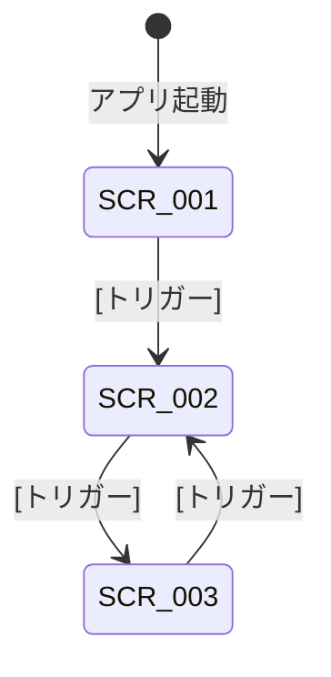

# 画面仕様書

## ドキュメント情報

| 項目           | 内容                                                                                 |
| -------------- | ------------------------------------------------------------------------------------ |
| プロダクト名   | [プロダクト名]                                                                       |
| 対象バージョン | [バージョン]                                                                         |
| 作成日         | [YYYY-MM-DD]                                                                         |
| 最終更新日     | [YYYY-MM-DD]                                                                         |
| 参照ドキュメント | PRD (`docs/product-requirements.md`)、機能設計書 (`docs/functional-design.md`) |

## 画面一覧

| 画面ID  | 画面名   | 種別     | 概要   | 対応機能(PRD) | 仕様ファイル              |
| ------- | -------- | -------- | ------ | ------------- | ------------------------- |
| SCR-001 | [画面名] | メイン   | [概要] | F1, F2        | `scr-001-[name].md` |
| SCR-002 | [画面名] | メイン   | [概要] | F3            | `scr-002-[name].md` |
| SCR-003 | [画面名] | サブ     | [概要] | F4            | `scr-003-[name].md` |
| SCR-004 | [画面名] | モーダル | [概要] | F5            | `scr-004-[name].md` |

## 画面遷移図

### 画面遷移一覧

| #   | 遷移元  | 遷移先  | トリガー | 遷移方法         | アニメーション   |
| --- | ------- | ------- | -------- | ---------------- | ---------------- |
| 1   | SCR-001 | SCR-002 | [操作]   | [push/modal/tab] | [アニメーション] |
| 2   | SCR-002 | SCR-003 | [操作]   | [push/modal/tab] | [アニメーション] |

## 共通挙動仕様

### アプリライフサイクル

| イベント                   | 挙動   |
| -------------------------- | ------ |
| コールドスタート           | [挙動] |
| バックグラウンドからの復帰 | [挙動] |
| メモリ警告                 | [挙動] |

### エラーハンドリング共通仕様

| エラー種別       | 表示方法   | ユーザーへの表示 | 自動リトライ |
| ---------------- | ---------- | ---------------- | ------------ |
| ネットワークエラー | [表示方法] | [メッセージ]     | [あり/なし]  |
| ストレージ不足   | [表示方法] | [メッセージ]     | [なし]       |
| 権限不足         | [表示方法] | [メッセージ]     | [なし]       |

### アプリ固有の共通仕様（任意）

> アプリに固有の共通的な状態管理仕様があれば記述してください。
> 例: ドラフト自動保存、オフライン同期、キャッシュ戦略、認証トークン管理など

| 項目   | 仕様   |
| ------ | ------ |
| [項目] | [仕様] |

## 画面状態一覧

| 画面ID  | 初期状態   | 入力中     | データあり | 空状態     | エラー     | ローディング |
| ------- | ---------- | ---------- | ---------- | ---------- | ---------- | ------------ |
| SCR-001 | [あり/なし] | [あり/なし] | -          | -          | [あり/なし] | -            |
| SCR-002 | [あり/なし] | -          | [あり/なし] | [あり/なし] | [あり/なし] | [あり/なし]  |

## PRD機能要件との対応表

| PRD機能ID | 機能名   | 優先度 | 対応画面 | 対応操作 | 実装状況       |
| --------- | -------- | ------ | -------- | -------- | -------------- |
| F1        | [機能名] | P0     | SCR-001  | [操作名] | [実装済/未実装] |
| F2        | [機能名] | P0     | SCR-001  | [操作名] | [実装済/未実装] |
