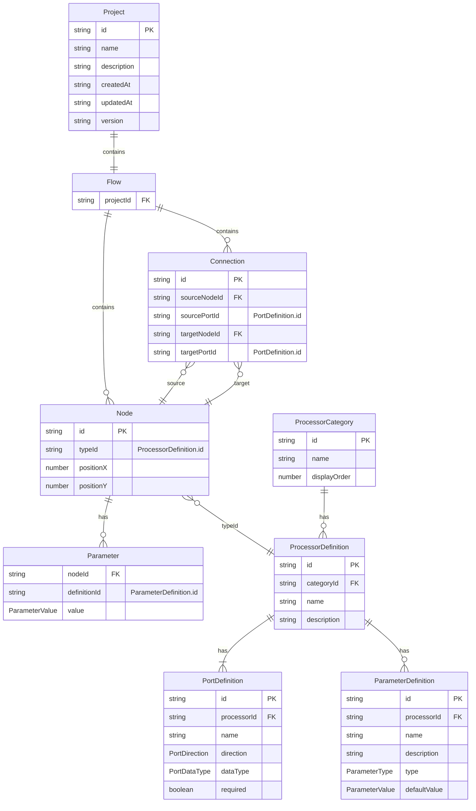

# データモデル設計書 (Data Model Design Document)

> 作成日: 2026-03-08
> 対象フェーズ: MVP（ノードベースフローエディタ + 従来型画像処理ノード群）
> 対応機能設計書: docs/functional-design.md

---

## 設計方針

データモデルを以下の2層に分離する。

- **グラフモデル層**: ノードの配置・接続・パラメータ値など、汎用的なグラフ構造を定義する。画像処理やAIなど特定のドメインに依存しない
- **プロセッサ定義層**: 各ノード種別が実際に行う処理の定義（ポート構成・パラメータ定義・カテゴリ）を管理する。グラフモデルとは `typeId` で紐づく

この分離により、グラフモデル層を変更せずに新しいノード種別（AI推論ノード等）を追加できる。

---

## エンティティ一覧

### グラフモデル層

| エンティティ | 説明 | ドメインモデル上の対応 |
|---|---|---|
| Project | 検査フローの管理単位 | Project |
| Flow | ノードと接続で構成されるグラフ構造 | Flow |
| Node | フロー上に配置されたノードのインスタンス | Node |
| Connection | ノード間のデータフロー接続 | Connection |
| Parameter | ノードインスタンスに設定されたパラメータ値 | Parameter（インスタンス側） |

### プロセッサ定義層

| エンティティ | 説明 | ドメインモデル上の対応 |
|---|---|---|
| ProcessorCategory | プロセッサのカテゴリ（入力・前処理・フィルタリング等） | NodeCategory |
| ProcessorDefinition | プロセッサの定義（名前・ポート構成・パラメータ定義） | NodeDefinition |
| PortDefinition | プロセッサ定義におけるポートの定義 | Port（定義側） |
| ParameterDefinition | プロセッサ定義におけるパラメータの定義 | Parameter（定義側） |

---

## エンティティ定義

### グラフモデル層

#### Project

```typescript
interface Project {
  id: string;              // プロジェクトの一意識別子
  name: string;            // プロジェクト名
  description: string;     // プロジェクトの説明
  flow: Flow;              // フロー定義
  createdAt: string;       // 作成日時（ISO 8601）
  updatedAt: string;       // 最終更新日時（ISO 8601）
  version: string;         // プロジェクトファイルフォーマットのバージョン
}
```

**フィールド定義**:

| フィールド | 型 | 必須 | 制約 | 説明 |
|---|---|---|---|---|
| id | string | Yes | UUID v4形式 | プロジェクトの一意識別子 |
| name | string | Yes | 最大200文字、空文字不可 | プロジェクト名 |
| description | string | No | 最大1000文字 | プロジェクトの説明 |
| flow | Flow | Yes | - | フロー定義 |
| createdAt | string | Yes | ISO 8601形式 | 作成日時 |
| updatedAt | string | Yes | ISO 8601形式 | 最終更新日時 |
| version | string | Yes | セマンティックバージョニング | プロジェクトファイルフォーマットのバージョン |

---

#### Flow

```typescript
interface Flow {
  nodes: Node[];               // フロー上のノード一覧
  connections: Connection[];   // 接続一覧
  viewport: Viewport;         // キャンバスの表示状態
}

interface Viewport {
  x: number;       // パン位置X
  y: number;       // パン位置Y
  zoom: number;    // ズーム倍率
}
```

**フィールド定義**:

| フィールド | 型 | 必須 | 制約 | 説明 |
|---|---|---|---|---|
| nodes | Node[] | Yes | - | フロー上に配置されたノードの配列 |
| connections | Connection[] | Yes | - | ノード間の接続の配列 |
| viewport | Viewport | Yes | - | キャンバスの表示状態（パン位置・ズーム倍率） |

**Viewport フィールド定義**:

| フィールド | 型 | 必須 | 制約 | 説明 |
|---|---|---|---|---|
| x | number | Yes | - | キャンバスのパン位置X |
| y | number | Yes | - | キャンバスのパン位置Y |
| zoom | number | Yes | 0.1以上、5.0以下 | ズーム倍率 |

---

#### Node

グラフ上のノードインスタンス。`typeId` でプロセッサ定義と紐づく。

```typescript
interface Node {
  id: string;                    // ノードインスタンスの一意識別子
  typeId: string;                // プロセッサ定義のID（ProcessorDefinition.idに対応）
  position: Position;            // キャンバス上の位置
  parameters: Parameter[];       // パラメータ値の配列
}

interface Position {
  x: number;   // X座標
  y: number;   // Y座標
}
```

**フィールド定義**:

| フィールド | 型 | 必須 | 制約 | 説明 |
|---|---|---|---|---|
| id | string | Yes | UUID v4形式、フロー内で一意 | ノードインスタンスの識別子 |
| typeId | string | Yes | 登録済みProcessorDefinition.idと一致 | このノードが使用するプロセッサ種別 |
| position | Position | Yes | - | キャンバス上の配置位置 |
| parameters | Parameter[] | Yes | - | パラメータ値の配列 |

**Position フィールド定義**:

| フィールド | 型 | 必須 | 制約 | 説明 |
|---|---|---|---|---|
| x | number | Yes | - | キャンバス上のX座標（ピクセル） |
| y | number | Yes | - | キャンバス上のY座標（ピクセル） |

> **グラフモデルとプロセッサ定義の関係**: Node は `typeId` のみを保持する。ポート構成やパラメータ定義は `typeId` に対応する ProcessorDefinition から参照される。グラフモデル層はプロセッサの具体的な処理内容を知らない。

---

#### Parameter

ノードインスタンスに設定されたパラメータ値。キーと値のペア。

```typescript
interface Parameter {
  definitionId: string;         // パラメータ定義のID
  value: ParameterValue;        // 設定された値
}

type ParameterValue = number | boolean | string;
```

**フィールド定義**:

| フィールド | 型 | 必須 | 制約 | 説明 |
|---|---|---|---|---|
| definitionId | string | Yes | 対応するProcessorDefinitionのParameterDefinition.idと一致 | パラメータ定義への参照 |
| value | ParameterValue | Yes | ParameterDefinitionのconstraintsに従う | ユーザーが設定した値 |

---

#### Connection

2つのノード間のデータフロー接続。接続先ポートは `portId`（プロセッサ定義側のPortDefinition.id）で指定する。

```typescript
interface Connection {
  id: string;              // 接続の一意識別子
  sourceNodeId: string;    // 接続元ノードのID
  sourcePortId: string;    // 接続元ポートID（PortDefinition.id）
  targetNodeId: string;    // 接続先ノードのID
  targetPortId: string;    // 接続先ポートID（PortDefinition.id）
}
```

**フィールド定義**:

| フィールド | 型 | 必須 | 制約 | 説明 |
|---|---|---|---|---|
| id | string | Yes | UUID v4形式、フロー内で一意 | 接続の識別子 |
| sourceNodeId | string | Yes | FK→Node.id | 接続元のノード |
| sourcePortId | string | Yes | 接続元ノードのProcessorDefinition内のPortDefinition.id | 接続元の出力ポート |
| targetNodeId | string | Yes | FK→Node.id | 接続先のノード |
| targetPortId | string | Yes | 接続先ノードのProcessorDefinition内のPortDefinition.id | 接続先の入力ポート |

---

### プロセッサ定義層

#### ProcessorCategory

```typescript
interface ProcessorCategory {
  id: string;          // カテゴリの一意識別子
  name: string;        // 表示名（例: "前処理", "フィルタリング"）
  displayOrder: number; // ノードライブラリでの表示順
}
```

**フィールド定義**:

| フィールド | 型 | 必須 | 制約 | 説明 |
|---|---|---|---|---|
| id | string | Yes | 英数字・ハイフン、最大50文字 | カテゴリの一意識別子（例: "preprocessing"） |
| name | string | Yes | 最大50文字 | UIに表示するカテゴリ名 |
| displayOrder | number | Yes | 0以上の整数 | ノードライブラリでの表示順序 |

---

#### ProcessorDefinition

ノード種別の定義。ノードが持つポート構成・パラメータ定義・表示情報を管理する。
グラフモデル層の `Node.typeId` がこのエンティティの `id` を参照する。

```typescript
interface ProcessorDefinition {
  id: string;                          // プロセッサ種別の一意識別子
  categoryId: string;                  // 所属カテゴリID
  name: string;                        // 表示名
  description: string;                 // プロセッサの説明（ツールチップ用）
  ports: PortDefinition[];             // ポート定義の配列
  parameters: ParameterDefinition[];   // パラメータ定義の配列
}
```

**フィールド定義**:

| フィールド | 型 | 必須 | 制約 | 説明 |
|---|---|---|---|---|
| id | string | Yes | 英数字・ハイフン、最大50文字、一意 | プロセッサ種別の識別子（例: "gaussian-blur"） |
| categoryId | string | Yes | FK→ProcessorCategory.id | 所属するカテゴリ |
| name | string | Yes | 最大100文字 | UIに表示するノード名 |
| description | string | Yes | 最大500文字 | プロセッサの説明文 |
| ports | PortDefinition[] | Yes | 1つ以上 | このプロセッサが持つポートの定義 |
| parameters | ParameterDefinition[] | No | - | このプロセッサが持つパラメータの定義 |

---

#### PortDefinition

```typescript
interface PortDefinition {
  id: string;              // ポート定義の識別子（プロセッサ内で一意）
  name: string;            // 表示名
  direction: PortDirection; // 入力 or 出力
  dataType: PortDataType;  // データ型
  required: boolean;       // 必須ポートかどうか（入力ポートのみ有効）
}

type PortDirection = "input" | "output";

type PortDataType = "image" | "number" | "boolean" | "contours" | "region";
```

**フィールド定義**:

| フィールド | 型 | 必須 | 制約 | 説明 |
|---|---|---|---|---|
| id | string | Yes | 英数字・ハイフン、最大50文字、プロセッサ内で一意 | ポートの識別子（例: "input-image"） |
| name | string | Yes | 最大50文字 | UIに表示するポート名 |
| direction | PortDirection | Yes | "input" \| "output" | ポートの入出力方向 |
| dataType | PortDataType | Yes | "image" \| "number" \| "boolean" \| "contours" \| "region" | ポートが扱うデータ型 |
| required | boolean | Yes | - | 入力ポートの場合、接続が必須かどうか。出力ポートでは常にfalse |

---

#### ParameterDefinition

```typescript
interface ParameterDefinition {
  id: string;                // パラメータの識別子（プロセッサ内で一意）
  name: string;              // 表示名
  description: string;       // パラメータの説明（ツールチップ用）
  type: ParameterType;       // パラメータの型
  defaultValue: ParameterValue; // デフォルト値
  constraints?: ParameterConstraints; // 値の制約
}

type ParameterType = "number" | "integer" | "boolean" | "string" | "enum" | "file-path";

interface ParameterConstraints {
  min?: number;              // 最小値（number/integer）
  max?: number;              // 最大値（number/integer）
  step?: number;             // ステップ値（number/integer）
  options?: EnumOption[];    // 選択肢（enum）
  fileExtensions?: string[]; // 許可する拡張子（file-path）
}

interface EnumOption {
  value: string;             // 内部値
  label: string;             // 表示名
}
```

**フィールド定義**:

| フィールド | 型 | 必須 | 制約 | 説明 |
|---|---|---|---|---|
| id | string | Yes | 英数字・ハイフン、最大50文字、プロセッサ内で一意 | パラメータの識別子 |
| name | string | Yes | 最大100文字 | UIに表示するパラメータ名 |
| description | string | Yes | 最大500文字 | パラメータの説明文 |
| type | ParameterType | Yes | "number" \| "integer" \| "boolean" \| "string" \| "enum" \| "file-path" | パラメータの型 |
| defaultValue | ParameterValue | Yes | typeに対応する型 | デフォルト値 |
| constraints | ParameterConstraints | No | - | 値の制約条件 |

---

## ER図



---

## バリデーションルール

### Project

| ルール | 対象フィールド | 条件 | エラー時の扱い |
|---|---|---|---|
| 名前必須 | name | 空文字でないこと | 保存を拒否し、エラーメッセージを表示 |
| 名前長制限 | name | 200文字以内 | 入力を制限 |
| バージョン形式 | version | セマンティックバージョニング形式であること | ファイル読み込みエラー |

### Node

| ルール | 対象フィールド | 条件 | エラー時の扱い |
|---|---|---|---|
| typeId解決可能 | typeId | 登録済みのProcessorDefinition.idと一致すること | ファイル読み込み時にエラーを通知 |
| ID一意性 | id | フロー内で一意であること | ファイル読み込み時にエラーを通知 |

### Parameter

| ルール | 対象フィールド | 条件 | エラー時の扱い |
|---|---|---|---|
| 型一致 | value | 対応するParameterDefinition.typeの型であること | デフォルト値にフォールバック |
| 数値範囲 | value | constraints.min以上、constraints.max以下（number/integerの場合） | 最寄りの境界値にクランプ |
| enum値 | value | constraints.optionsに含まれる値であること（enumの場合） | デフォルト値にフォールバック |
| ファイル拡張子 | value | constraints.fileExtensionsに含まれる拡張子であること（file-pathの場合） | エラーメッセージを表示し、値を拒否 |

### Connection

| ルール | 対象フィールド | 条件 | エラー時の扱い |
|---|---|---|---|
| ポート型一致 | sourcePortId, targetPortId | 接続元ポートのdataTypeと接続先ポートのdataTypeが一致すること | 接続を拒否し、エラーを視覚表示 |
| 方向チェック | sourcePortId, targetPortId | 接続元がoutput、接続先がinputであること | 接続を拒否 |
| 入力ポート単一接続 | targetPortId + targetNodeId | 1つの入力ポートへの接続は1本のみ | 既存接続を置き換えるか確認 |
| 循環禁止 | sourceNodeId, targetNodeId | 接続を追加した結果、フローに循環が生じないこと | 接続を拒否し、エラーを視覚表示 |
| 自己接続禁止 | sourceNodeId, targetNodeId | 同一ノードのポート間を接続しないこと | 接続を拒否 |

---

## 永続化形式

### SQLiteテーブル構成

グラフモデル層のデータはSQLiteに永続化される。プロセッサ定義はアプリケーション組み込みのレジストリで管理され、`typeId` で参照される。

**projects テーブル**:

| カラム | 型 | 制約 | 説明 |
|---|---|---|---|
| id | TEXT | PRIMARY KEY | UUID v4 |
| name | TEXT | NOT NULL, MAX 200 | プロジェクト名 |
| description | TEXT | | プロジェクトの説明 |
| created_at | TEXT | NOT NULL | ISO 8601形式 |
| updated_at | TEXT | NOT NULL | ISO 8601形式 |
| version | TEXT | NOT NULL | ファイルフォーマットバージョン |

**flows テーブル**:

| カラム | 型 | 制約 | 説明 |
|---|---|---|---|
| project_id | TEXT | PRIMARY KEY, FK→projects.id | 所属プロジェクト（1:1） |
| viewport_x | REAL | NOT NULL, DEFAULT 0 | ビューポートX |
| viewport_y | REAL | NOT NULL, DEFAULT 0 | ビューポートY |
| viewport_zoom | REAL | NOT NULL, DEFAULT 1.0, CHECK(0.1〜5.0) | ズーム倍率 |

**nodes テーブル**:

| カラム | 型 | 制約 | 説明 |
|---|---|---|---|
| id | TEXT | PRIMARY KEY | UUID v4 |
| flow_id | TEXT | NOT NULL, FK→flows.project_id | 所属フロー |
| type_id | TEXT | NOT NULL | ProcessorDefinition.id |
| position_x | REAL | NOT NULL | キャンバスX座標 |
| position_y | REAL | NOT NULL | キャンバスY座標 |

**parameters テーブル**:

| カラム | 型 | 制約 | 説明 |
|---|---|---|---|
| node_id | TEXT | NOT NULL, FK→nodes.id | 所属ノード |
| definition_id | TEXT | NOT NULL | ParameterDefinition.id |
| value | TEXT | NOT NULL | JSON エンコードされた値 |
| | | PRIMARY KEY(node_id, definition_id) | 複合主キー |

**connections テーブル**:

| カラム | 型 | 制約 | 説明 |
|---|---|---|---|
| id | TEXT | PRIMARY KEY | UUID v4 |
| flow_id | TEXT | NOT NULL, FK→flows.project_id | 所属フロー |
| source_node_id | TEXT | NOT NULL, FK→nodes.id | 接続元ノード |
| source_port_id | TEXT | NOT NULL | 接続元PortDefinition.id |
| target_node_id | TEXT | NOT NULL, FK→nodes.id | 接続先ノード |
| target_port_id | TEXT | NOT NULL | 接続先PortDefinition.id |
| | | UNIQUE(target_node_id, target_port_id) | 入力ポートへの接続は1本のみ |

### エクスポート形式（.vinsp）

プロジェクトの移行・共有用にJSON形式でエクスポート可能。SQLiteのデータをJSON構造に変換する。

```json
{
  "id": "550e8400-e29b-41d4-a716-446655440000",
  "name": "表面キズ検査フロー",
  "description": "製品表面のキズを検出する検査パイプライン",
  "version": "1.0.0",
  "createdAt": "2026-03-08T10:00:00Z",
  "updatedAt": "2026-03-08T15:30:00Z",
  "flow": {
    "viewport": { "x": 0, "y": 0, "zoom": 1.0 },
    "nodes": [
      {
        "id": "node-001",
        "typeId": "image-file-input",
        "position": { "x": 100, "y": 200 },
        "parameters": [
          { "definitionId": "file-path", "value": "/images/sample.png" }
        ]
      },
      {
        "id": "node-002",
        "typeId": "gaussian-blur",
        "position": { "x": 400, "y": 200 },
        "parameters": [
          { "definitionId": "kernel-size", "value": 5 },
          { "definitionId": "sigma", "value": 1.0 }
        ]
      }
    ],
    "connections": [
      {
        "id": "conn-001",
        "sourceNodeId": "node-001",
        "sourcePortId": "output-image",
        "targetNodeId": "node-002",
        "targetPortId": "input-image"
      }
    ]
  }
}
```

**備考**:
- ファイル拡張子は `.vinsp`（VisualInspect の略）
- エンコーディングはUTF-8
- エクスポートにはグラフモデル層のデータのみを含む
- プロセッサ定義はアプリケーション側のレジストリで管理され、`typeId` で解決される
- インポート時はJSONバリデーション後にSQLiteへ投入

---

## 機能設計書ドメインモデルとの対応確認

| 機能設計書のエンティティ | データモデルのエンティティ | 備考 |
|---|---|---|
| Project | Project | 1:1対応 |
| Flow | Flow | 1:1対応 |
| Node | Node | 1:1対応。`typeId` でプロセッサ定義と紐づく |
| Port | PortDefinition | プロセッサ定義層に配置。ランタイムのポートは ProcessorDefinition から生成 |
| Parameter | Parameter + ParameterDefinition | 値（グラフ層）と定義（プロセッサ定義層）に分離 |
| Connection | Connection | 1:1対応 |
| NodeDefinition | ProcessorDefinition | 名称変更。グラフ構造から独立した処理定義として再定義 |
| NodeCategory | ProcessorCategory | 名称変更。プロセッサ定義層に配置 |

---

## 将来フェーズへの備考

| フェーズ | 追加・変更予定のエンティティ | 現フェーズでの考慮点 |
|---|---|---|
| フェーズ2 | AI系ProcessorDefinition（分類・物体検出・セグメンテーション等）、TrainingJob、Model | プロセッサ定義層に新しいProcessorDefinitionを追加するだけでグラフモデル層は変更不要。PortDataTypeにtensor等のAI向け型を追加想定 |
| フェーズ2 | ImageAsset、Dataset、Annotation | Projectにアセット管理情報を追加する拡張余地を残す |
| フェーズ3 | TestSuite、TestResult | フロー実行結果の構造をバッチテストに転用できるよう設計 |
| フェーズ3 | FlowTemplate | Project形式をそのままテンプレートとして利用可能 |
