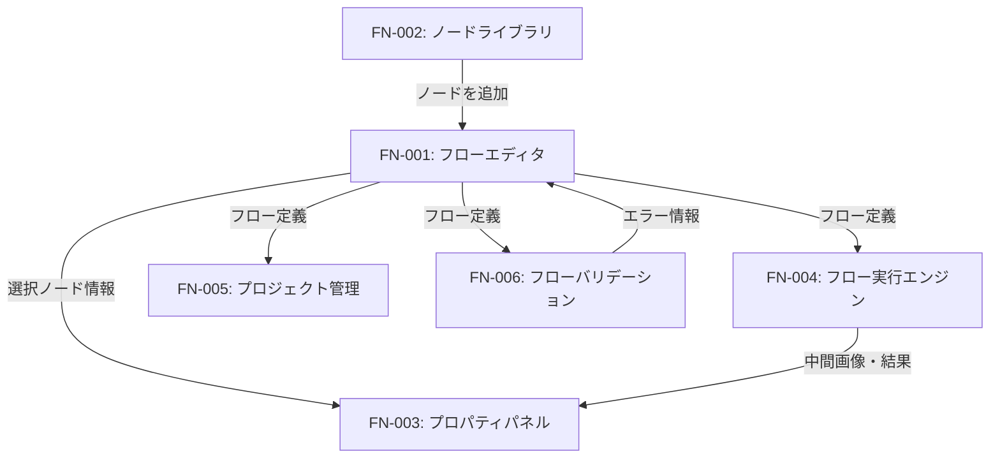
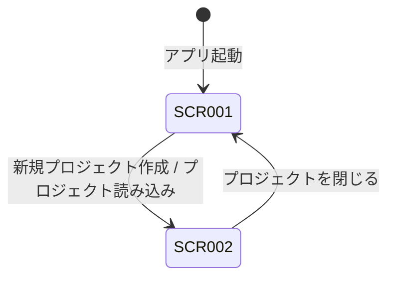
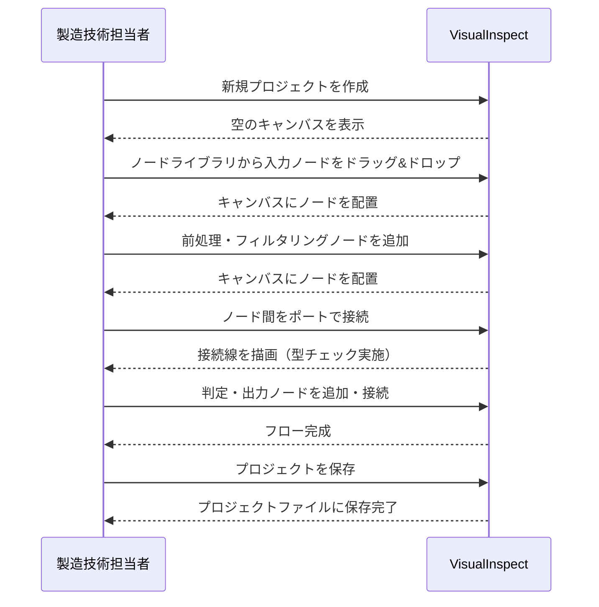
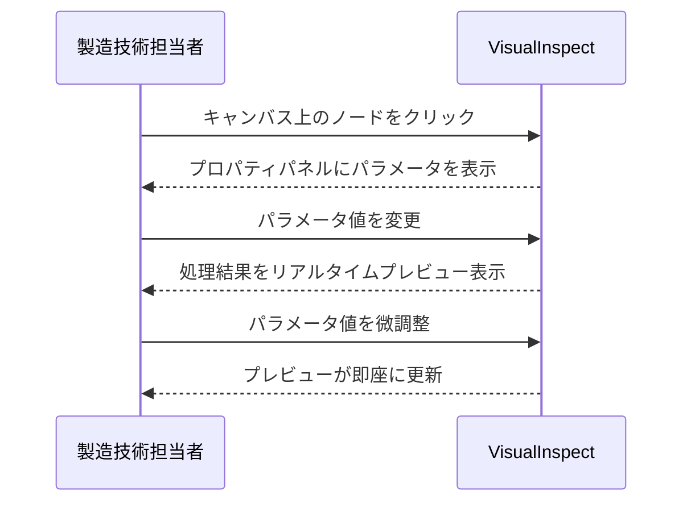
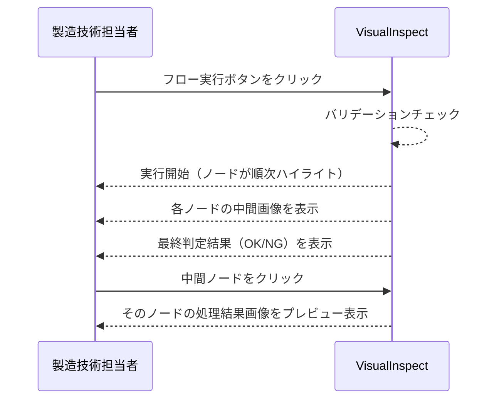

# 機能設計書 (Functional Design Document)

> 作成日: 2026-03-07
> 対象フェーズ: MVP（ノードベースフローエディタ + 従来型画像処理ノード群）
> 対応PRD: docs/product-requirements.md

---

## 機能一覧

PRDの要求を具体的な機能に分解し、一覧化する。

| 機能ID | 機能名 | 説明 | 対応するPRD要件 |
|---|---|---|---|
| FN-001 | フローエディタ | ノードの配置・接続・編集を行うキャンバスベースのビジュアルエディタ | 機能1: ノードベースフローエディタ |
| FN-002 | ノードライブラリ | 利用可能なノードの一覧表示・検索・カテゴリフィルタ・キャンバスへの追加 | 機能2: 従来型画像処理ノード群 |
| FN-003 | プロパティパネル | 選択したノードのパラメータ設定とリアルタイムプレビュー | 機能1, 機能2 |
| FN-004 | フロー実行エンジン | フローの実行制御と各ノードの処理結果（中間画像）の取得 | 機能1: フロー実行・プレビュー |
| FN-005 | プロジェクト管理 | フロー定義のプロジェクトファイルとしての保存・読み込み・自動バックアップ | 機能1: フロー保存・読み込み |
| FN-006 | フローバリデーション | 接続の不整合やパラメータ不正の検出と視覚的な通知 | 機能1: エラー通知 |

### 機能間の関係



### 機能詳細

#### FN-001: フローエディタ

**概要**: 検査パイプラインを視覚的に構築するためのキャンバスベースのエディタ。ノードの配置・接続・操作を提供し、検査フローの全体像を直感的に把握・編集できる。

**含まれるサブ機能**:
- キャンバス操作: ズーム・パン（マウスホイール・ドラッグ対応）
- ノード配置: ドラッグ&ドロップでキャンバス上にノードを配置
- ノード接続: ポート間をドラッグして接続線を作成し、データフローを定義
- 接続線管理: 接続線の選択・削除
- ノード操作: ノードの移動・複製・削除・複数選択
- Undo/Redo: 最低20ステップの操作履歴管理
- 条件分岐: 条件分岐ノードによる処理パスの分岐

**入力と出力**:
- 入力: ユーザーのマウス・キーボード操作、ノードライブラリからのノード追加
- 出力: フロー定義（ノード配置・接続・パラメータの構造データ）

**ビジネスルール**:
- ノード間の接続はポートの型（画像、数値、判定結果など）が一致する場合のみ許可する
- 循環する接続（ループ）は禁止する
- 1つの入力ポートに接続できる接続線は1本のみ（1つの出力ポートからは複数の接続線を許可）

---

#### FN-002: ノードライブラリ

**概要**: 利用可能な全ノードをカテゴリ別に一覧表示し、検索・フィルタ機能で目的のノードを素早く見つけてキャンバスに追加できるパネル。

**含まれるサブ機能**:
- カテゴリ別一覧表示: ノードをカテゴリごとにグループ化して表示
- キーワード検索: ノード名・説明文でのインクリメンタル検索
- カテゴリフィルタ: カテゴリによる絞り込み
- ドラッグ&ドロップ追加: ノードをライブラリからキャンバスへドラッグ&ドロップで追加
- ツールチップ: 各ノードにマウスホバーでパラメータ説明を表示

**入力と出力**:
- 入力: 検索キーワード、カテゴリ選択、ドラッグ操作
- 出力: フィルタされたノード一覧、キャンバスへのノード追加

**ビジネスルール**:
- ノードはカテゴリ（入力、前処理、フィルタリング、二値化、エッジ検出、形状処理、形状マッチング、判定、出力）で分類される
- 検索はノード名と説明文の両方を対象とする

---

#### FN-003: プロパティパネル

**概要**: キャンバス上で選択したノードのパラメータを表示・編集するパネル。パラメータ変更時にリアルタイムで処理結果をプレビューできる。

**含まれるサブ機能**:
- パラメータ表示・編集: 選択ノードのパラメータをフォーム形式で表示・編集
- リアルタイムプレビュー: パラメータ変更時に処理結果画像を即座にプレビュー表示
- パラメータ説明: 各パラメータのツールチップ・ヘルプテキスト

**入力と出力**:
- 入力: キャンバスでのノード選択、パラメータ値の変更
- 出力: 更新されたノードパラメータ、プレビュー画像

**ビジネスルール**:
- ノード未選択時はパネルを空表示（または使い方のヒントを表示）
- パラメータ変更はフロー定義に即座に反映される
- プレビューは該当ノードまでの処理を実行して中間結果を表示する

---

#### FN-004: フロー実行エンジン

**概要**: 構築されたフローを実行し、各ノードの処理を順序に従って実行する。実行中の進捗表示と、各ノードの中間画像・処理結果の取得を行う。

**含まれるサブ機能**:
- フロー実行: フロー全体を入力ノードから出力ノードまで順次実行
- 中間結果保持: 各ノードの処理結果（中間画像）を保持し、プレビュー用に提供
- 実行状態表示: 実行中のノードのハイライト表示、処理完了/エラー状態の表示
- 条件分岐の評価: 条件分岐ノードの判定結果に応じた処理パスの選択

**入力と出力**:
- 入力: フロー定義、入力画像
- 出力: 各ノードの中間画像、最終判定結果（OK/NG）、実行ステータス

**ビジネスルール**:
- フローにバリデーションエラーがある場合は実行を開始しない
- 処理エラーが発生した場合、アプリをクラッシュさせずエラーメッセージを表示して実行を停止する
- 条件分岐では、条件を満たすパスのみ後続ノードを実行する

---

#### FN-005: プロジェクト管理

**概要**: フロー定義をプロジェクトファイルとして保存・読み込みする。自動バックアップにより編集中の作業データを保護する。

**含まれるサブ機能**:
- 新規プロジェクト作成: 空のフローで新規プロジェクトを作成
- プロジェクト保存: フロー定義をプロジェクトファイルとして保存
- プロジェクト読み込み: 保存済みプロジェクトファイルの読み込み
- 自動バックアップ: 5分ごとの自動保存と、クラッシュ後の復元
- 最近のプロジェクト: 最近開いたプロジェクトの一覧表示

**入力と出力**:
- 入力: ユーザーの保存・読み込み操作、自動バックアップタイマー
- 出力: プロジェクトファイル（フロー定義の永続化）

**ビジネスルール**:
- プロジェクトファイルの保存はアトミックに行い、書き込み中のクラッシュによるファイル破損を防止する
- 未保存の変更がある状態でアプリ終了・別プロジェクト読み込み時は確認ダイアログを表示する
- 1アプリインスタンスで最大50プロジェクトを管理可能

---

#### FN-006: フローバリデーション

**概要**: フロー定義の整合性をリアルタイムに検証し、エラーをキャンバス上で視覚的に通知する。

**含まれるサブ機能**:
- 接続の型チェック: ポート間の型一致を検証
- 循環検出: フロー内のループを検出
- パラメータ検証: 必須パラメータの未設定、範囲外の値を検出
- 未接続ポート検出: 必須入力ポートが未接続のノードを検出
- エラー表示: エラー箇所のハイライト表示とエラー原因の説明

**入力と出力**:
- 入力: フロー定義（ノード・接続・パラメータ）
- 出力: バリデーション結果（エラー一覧と対象ノード・接続の情報）

**ビジネスルール**:
- バリデーションはフロー編集時にリアルタイムで実行される
- エラーがあるノード・接続線は視覚的に区別される（色・アイコン）
- エラー箇所にマウスホバーでエラー原因の説明を表示する

---

## ドメインモデル（概念レベル）

このアプリケーションに登場する主要な概念（エンティティ）と、それらの関係を示す。

> **注意**: ここでは概念レベルの関係性のみを記載する。各エンティティの具体的なフィールド定義・型・制約は、データモデル設計書で定義する。

```mermaid
erDiagram
    PROJECT ||--|| FLOW : "contains"
    FLOW ||--o{ NODE : "contains"
    FLOW ||--o{ CONNECTION : "contains"
    NODE ||--o{ PORT : "has"
    NODE ||--o{ PARAMETER : "has"
    NODE }o--|| NODE_DEFINITION : "instance of"
    CONNECTION ||--|| PORT : "from (output)"
    CONNECTION ||--|| PORT : "to (input)"
    NODE_DEFINITION }o--|| NODE_CATEGORY : "belongs to"

    PROJECT { summary "検査フローの管理単位" }
    FLOW { summary "ノードと接続で構成される検査パイプライン" }
    NODE { summary "フロー上に配置された処理ノードのインスタンス" }
    PORT { summary "ノードの入出力ポート" }
    PARAMETER { summary "ノードの設定パラメータ値" }
    CONNECTION { summary "ポート間のデータフロー接続" }
    NODE_DEFINITION { summary "ノード種別の定義（名前・ポート構成・パラメータ定義）" }
    NODE_CATEGORY { summary "ノード種別のカテゴリ（入力・前処理・フィルタリング等）" }
```

| エンティティ | 説明 | 主な関係 |
|---|---|---|
| Project | 検査フローの管理単位。保存・読み込みの対象 | 1つのFlowを含む |
| Flow | ノードと接続で構成される検査パイプライン | 複数のNode・Connectionを含む |
| Node | フロー上に配置された処理ノードのインスタンス | 複数のPort・Parameterを持つ。NodeDefinitionに基づく |
| Port | ノードの入出力ポート。型情報を持つ | Connectionの接続元・接続先となる |
| Parameter | ノードの設定パラメータの値 | Nodeに属する |
| Connection | 2つのポート間のデータフロー接続 | 出力Portから入力Portへの関係 |
| NodeDefinition | ノード種別の定義（名前・ポート構成・パラメータ定義） | NodeCategoryに属する |
| NodeCategory | ノード種別のカテゴリ（入力・前処理・フィルタリング等） | 複数のNodeDefinitionを持つ |

---

## 画面構成

### 画面一覧

| 画面ID | 画面名 | 説明 | 主な機能 |
|---|---|---|---|
| SCR-001 | スタート画面 | アプリ起動時に表示。プロジェクトの新規作成・既存プロジェクトの読み込みを行う | FN-005 |
| SCR-002 | メインエディタ画面 | フローエディタ・ノードライブラリ・プロパティパネルを統合したメイン作業画面 | FN-001, FN-002, FN-003, FN-004, FN-006 |

### 画面遷移図



### 画面レイアウト（概要）

> **注意**: ここでは「だいたいこんなアプリ」が伝わる概要レベルのレイアウトを示す。各画面の全UI要素定義、状態別ワイヤーフレーム、操作挙動の詳細は `docs/screen-specification/` で定義する。

#### SCR-001: スタート画面

```
+--------------------------------------------------+
|  VisualInspect                                    |
+--------------------------------------------------+
|                                                    |
|  [新規プロジェクト作成ボタン]                       |
|                                                    |
|  最近のプロジェクト:                                |
|  - プロジェクト名1 (最終更新日)                     |
|  - プロジェクト名2 (最終更新日)                     |
|  - ...                                             |
|                                                    |
|  [プロジェクトファイルを開く]                        |
|                                                    |
+--------------------------------------------------+
```

#### SCR-002: メインエディタ画面

```
+--------------------------------------------------+
|  メニューバー（ファイル・編集・表示・実行）         |
+--------------------------------------------------+
|  ツールバー（保存・Undo/Redo・実行・停止）          |
+-----------+----------------------------+----------+
|           |                            |          |
| ノード    |     フローエディタ          | プロパ   |
| ライブラリ|     キャンバス              | ティ     |
|           |                            | パネル   |
| [検索]    |  [ノード] --> [ノード]      |          |
| カテゴリ1 |      |                     | パラメータ|
|  - ノードA|  [ノード] --> [ノード]      | 設定     |
|  - ノードB|                            |          |
| カテゴリ2 |                            | プレビュー|
|  - ノードC|                            | 画像     |
|  - ノードD|                            |          |
+-----------+----------------------------+----------+
|  ステータスバー（バリデーション状態・実行状態）      |
+--------------------------------------------------+
```

---

## ユーザーフロー

主要な機能について、ユーザーがどのように操作するかを概要レベルで示す。

### UF-1: 検査フローの構築

**概要**: 製造技術担当者が新規プロジェクトを作成し、ノードを配置・接続して検査フローを構築する。



**フロー説明**:

1. スタート画面から新規プロジェクトを作成し、メインエディタ画面に遷移する
2. ノードライブラリから必要なノードを検索・選択し、キャンバスにドラッグ&ドロップで配置する
3. ノードのポート間をドラッグして接続線を作成し、データの流れを定義する
4. 処理の流れが完成したらプロジェクトを保存する

---

### UF-2: ノードパラメータの調整とプレビュー

**概要**: 配置したノードのパラメータを調整しながら、リアルタイムプレビューで処理結果を確認する。



**フロー説明**:

1. キャンバス上のノードをクリックして選択する
2. プロパティパネルにノードのパラメータが表示される
3. パラメータ値を変更すると、該当ノードまでの処理が実行され、結果がプレビュー表示される
4. プレビューを見ながらパラメータを繰り返し調整する

---

### UF-3: フローの実行と結果確認

**概要**: 構築した検査フローを実行し、各ノードの中間結果と最終判定結果を確認する。



**フロー説明**:

1. ツールバーの実行ボタンをクリックする
2. バリデーションが実行され、エラーがなければフロー実行が開始される
3. 実行中のノードがハイライトされ、処理の進行が視覚的に確認できる
4. 実行完了後、最終判定結果が表示される
5. 任意のノードをクリックすると、そのノードの中間画像をプレビューで確認できる

---

## 機能カタログ: ノード種別一覧

MVPで提供するノードの一覧。各ノードは画像処理の1つの操作に対応する。

| カテゴリ | ノード名 | 説明 |
|---|---|---|
| **入力** | カメラ入力 | 接続されたカメラから画像を取得する |
| **入力** | 画像ファイル読み込み | ファイルシステムから画像ファイルを読み込む |
| **前処理** | グレースケール変換 | カラー画像をグレースケールに変換する |
| **前処理** | リサイズ | 画像を指定サイズに拡大・縮小する |
| **前処理** | 回転・反転 | 画像を回転または反転する |
| **前処理** | クロップ | 画像の指定領域を切り出す |
| **前処理** | 正規化 | 画像の画素値を正規化する |
| **フィルタリング** | ガウシアンブラー | ガウシアンフィルタによるぼかし処理を行う |
| **フィルタリング** | メディアンフィルタ | メディアンフィルタによるノイズ除去を行う |
| **フィルタリング** | シャープネス | エッジを強調するシャープニング処理を行う |
| **二値化** | 大津の二値化 | 大津の方法で自動閾値を算出し二値化する |
| **二値化** | 適応的二値化 | 局所的な閾値で二値化する |
| **二値化** | 閾値指定二値化 | 指定した閾値で二値化する |
| **エッジ検出** | Canny | Cannyエッジ検出器でエッジを抽出する |
| **エッジ検出** | Sobel | Sobelフィルタでエッジを抽出する |
| **エッジ検出** | Laplacian | Laplacianフィルタでエッジを抽出する |
| **形状処理** | 膨張 | モルフォロジー膨張処理を行う |
| **形状処理** | 収縮 | モルフォロジー収縮処理を行う |
| **形状処理** | オープニング | モルフォロジーオープニング処理を行う |
| **形状処理** | クロージング | モルフォロジークロージング処理を行う |
| **形状処理** | 輪郭検出 | 画像中の輪郭を検出する |
| **形状マッチング** | テンプレートマッチング | テンプレート画像との一致箇所を検出する |
| **判定** | しきい値判定 | 数値がしきい値を満たすか判定する（OK/NG） |
| **判定** | 面積判定 | 検出領域の面積が基準を満たすか判定する |
| **判定** | カウント判定 | 検出数が基準を満たすか判定する |
| **フロー制御** | 条件分岐 | 判定結果に応じて処理パスを分岐する |
| **出力** | 結果画像保存 | 処理結果の画像をファイルに保存する |
| **出力** | 判定結果出力 | 最終判定結果（OK/NG）を出力する |

---

## PRD機能要件との対応確認

| PRD機能要件 | 対応する機能 / 画面 |
|---|---|
| ノードをキャンバス上にドラッグ&ドロップで配置 | FN-001 / SCR-002 |
| ノード間をポートで接続しデータフローを定義 | FN-001 / SCR-002 |
| 条件分岐ノードで異なる処理パスに分岐 | FN-001, FN-004 / SCR-002 |
| フローをプロジェクトファイルとして保存・読み込み | FN-005 / SCR-001, SCR-002 |
| ノードのパラメータをプロパティパネルから設定 | FN-003 / SCR-002 |
| フロー実行と各ノードの中間画像プレビュー | FN-004 / SCR-002 |
| 接続の不整合のエラーを視覚的に通知 | FN-006 / SCR-002 |
| キャンバスのズーム・パン操作 | FN-001 / SCR-002 |
| Undo/Redo（最低20ステップ） | FN-001 / SCR-002 |
| 各カテゴリのノードが利用可能 | FN-002 / SCR-002 |
| 各ノードのパラメータをリアルタイムプレビューしながら調整 | FN-003 / SCR-002 |
| ノードライブラリから検索・カテゴリフィルタで検索 | FN-002 / SCR-002 |
| 各ノードにツールチップ表示 | FN-002, FN-003 / SCR-002 |

---

## 将来フェーズへの備考

| フェーズ | 追加予定の機能 | 現フェーズでの考慮点 |
|---|---|---|
| フェーズ2 | AI学習・推論ノード | ノード定義の仕組みを拡張可能に設計し、AI系ノードを追加できるようにする |
| フェーズ2 | 画像アセット管理 | プロジェクトファイル構造を画像アセットの管理に対応できるよう考慮する |
| フェーズ2 | アノテーション機能 | 画像アセット管理と連携するためのデータ構造を意識する |
| フェーズ3 | フロー検証・評価機能 | フロー実行エンジンのバッチ実行対応を想定しておく |
| フェーズ3 | テンプレート機能 | プロジェクトファイル形式をテンプレートとしても利用できる構造にする |
| フェーズ4 | 検査実行画面 | フロー実行エンジンをUIから分離可能な設計にする |
| フェーズ5 | クラウド連携 | プロジェクトデータの形式を同期可能な構造にしておく |
