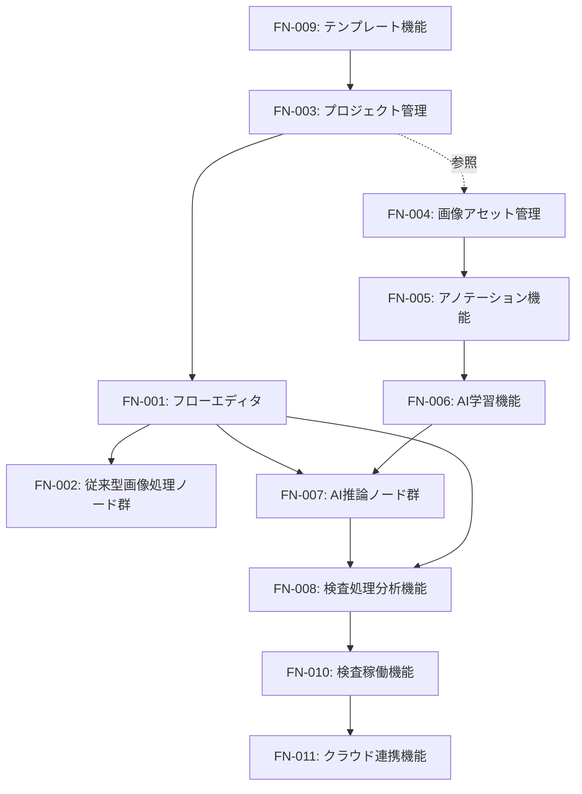
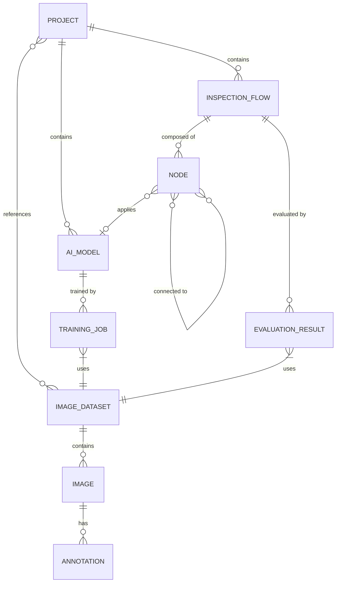
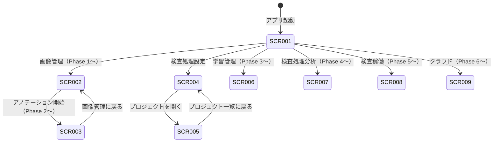
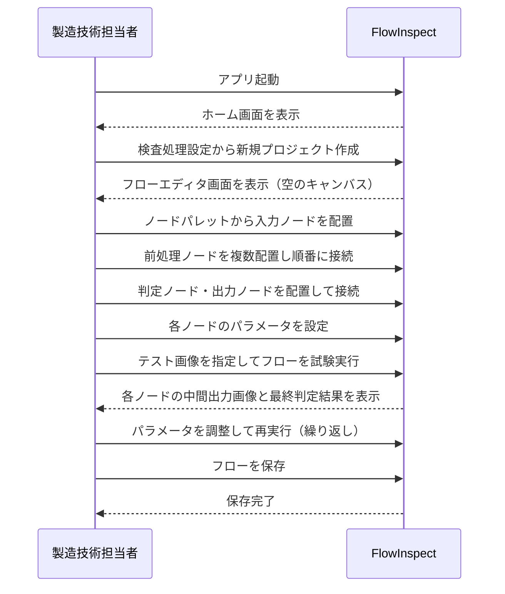
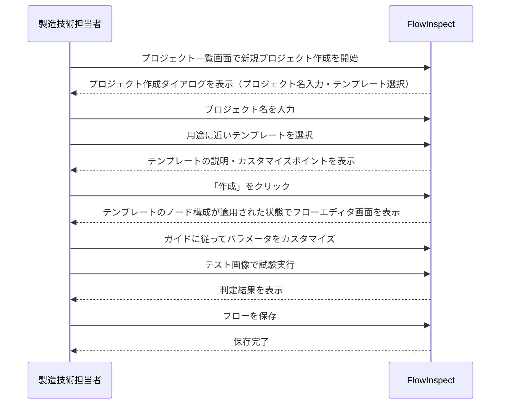
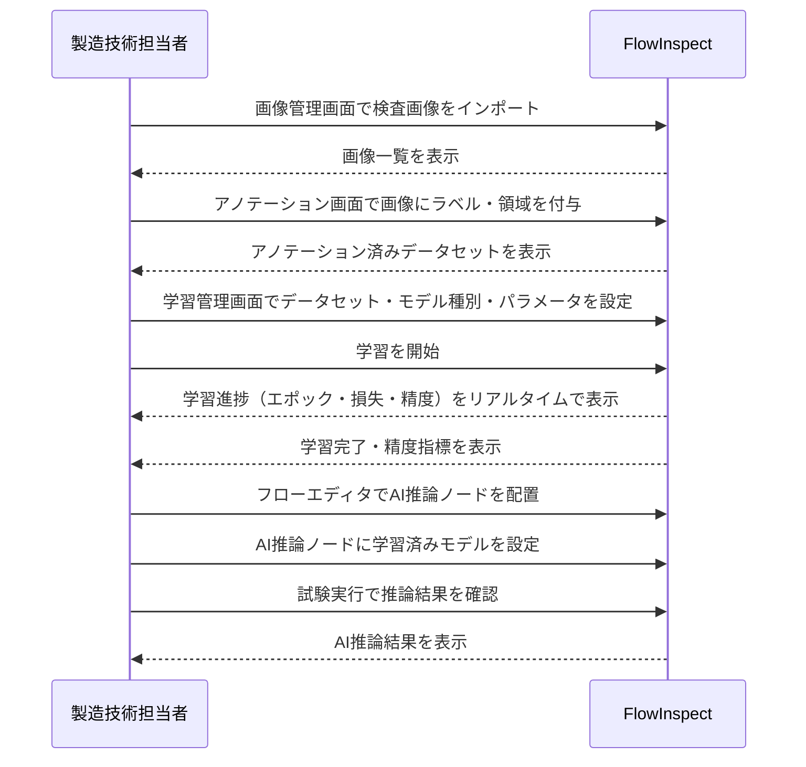
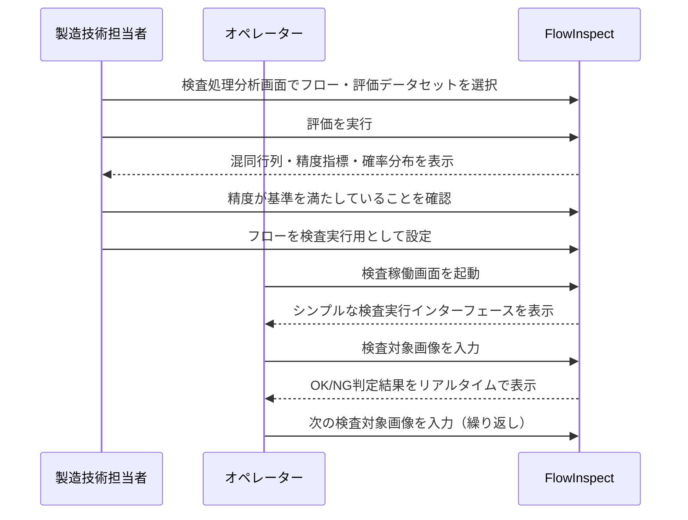

# 機能設計書 (Functional Design Document)

> 作成日: 2026-03-10
> 対象フェーズ: MVP + Post-MVP 全フェーズ
> 対応PRD: docs/product-requirements.md

---

## 機能一覧

PRDの要求を具体的な機能に分解し、一覧化する。

| 機能ID | 機能名 | 説明 | 対応するPRD要件 |
|---|---|---|---|
| FN-001 | フローエディタ | ノードベースで検査パイプラインを視覚的に設計する | ノードベースフローエディタ（P0）|
| FN-002 | 従来型画像処理ノード群 | フィルタリング・二値化・エッジ検出などの画像処理をノードとして提供する | 従来型画像処理ノード群（P0）|
| FN-003 | プロジェクト管理 | 検査フローとAIモデルをプロジェクト単位で管理し、画像データセットを参照する | プロジェクト単位での管理（フローエディタの前提）|
| FN-004 | 画像アセット管理 | 画像データセットをプロジェクトとは独立して管理・整理する | 画像アセット管理（Phase 1）|
| FN-005 | アノテーション機能 | AI学習用の画像アノテーションをアプリ内で実施する | アノテーション機能（Phase 2）|
| FN-006 | AI学習機能 | アノテーション済みデータセットを用いてAIモデルをローカルGPUで学習する | AI学習機能（Phase 3）|
| FN-007 | AI推論ノード群 | 分類・物体検出・セグメンテーション・良品学習・OCRのAIタスクをノードとして提供する | AI推論ノード（Phase 3）|
| FN-008 | 検査処理分析機能 | テスト用画像セットを用いて検査フローの精度を評価・可視化する | 画像処理フロー評価機能（Phase 4）|
| FN-009 | テンプレート機能 | よくある検査パターンをテンプレートとして提供し、フロー構築の出発点とする | テンプレート機能（Phase 4）|
| FN-010 | 検査稼働機能 | 現場での実運用向けにシンプルな操作で検査を実行・結果確認する | 検査実行画面（Phase 5）|
| FN-011 | クラウド連携機能 | 検査データのクラウド保存・設定バックアップ・クラウド学習を提供する | クラウド連携（Phase 6）|

### 機能間の関係

### 機能詳細

#### FN-001: フローエディタ

**概要**: 画像入力から前処理・推論・判定・結果出力までの検査パイプラインをノードベースで視覚的に設計する。Node-RED風のUIで、検査ロジックの全体像を直感的に把握・編集できる。

**含まれるサブ機能**:
- ノード配置: キャンバス上にノードを追加・移動・削除する
- ノード接続: ノード間をワイヤー（エッジ）でつなぎデータフローを定義する
- ノードパラメータ編集: 各ノードの設定値を調整する
- 条件分岐: 検査結果に応じて処理経路を分岐させる
- フロー保存・読み込み: 作成したフローをプロジェクトに保存し、再編集できる
- フロー実行（デバッグ）: エディタ上で検査フローを試験実行し、各ノードの中間出力を確認する
- キャンバス操作: ズーム・パン・全体表示などのキャンバス操作

**入力と出力**:
- 入力: ユーザーのノード配置・接続操作、各ノードへのパラメータ設定
- 出力: 検査パイプラインの定義（フロー設定）、試験実行時の中間画像・判定結果

**ビジネスルール**:
- フローはプロジェクトに紐づく
- フロー設定はアプリのクラッシュ時でも消失しないよう自動保存または保存確認を行う
- 50ノード以上で構成されるフローを問題なく設計・実行できること
- ノードの接続は型（画像・数値・判定結果など）の互換性に基づいて制限できること

---

#### FN-002: 従来型画像処理ノード群

**概要**: 一般的な画像前処理・特徴抽出に必要なノードを提供し、フローエディタ（FN-001）上で利用可能にする。各ノードはパラメータを調整しながら検査フローに組み込む。

**含まれるサブ機能**:
- 入力ノード: カメラ・ファイルからの画像入力
- フィルタリングノード: ガウシアンフィルタ・メディアンフィルタ等のノイズ除去
- 二値化ノード: 閾値処理による二値化
- エッジ検出ノード: Sobel・Cannyなどのエッジ検出
- 形状マッチングノード: テンプレートマッチングによる形状・パターン検出
- 色変換ノード: グレースケール変換・色空間変換
- 領域分割ノード: ROI（関心領域）の切り出し
- 判定ノード: 処理結果に基づいたOK/NG判定
- 出力ノード: 判定結果・画像の出力

**入力と出力**:
- 入力: 前段ノードからの画像データ、ユーザーが設定するパラメータ値
- 出力: 処理後の画像データ、またはOK/NG判定値・数値特徴量

**ビジネスルール**:
- 各ノードはFN-001のフローエディタ上でのみ使用可能
- 同一のフロー設定・同一の入力画像に対して、処理結果が常に同一であること（再現性100%）

---

#### FN-003: プロジェクト管理

**概要**: 検査フロー・AIモデルをプロジェクトという単位にまとめて管理する。プロジェクトは画像データセット（FN-004）を参照して使用する。検査ラインや製品ごとにプロジェクトを分けて管理できる。

**含まれるサブ機能**:
- プロジェクト作成・削除: 新規プロジェクトの作成とプロジェクトの削除
- プロジェクト一覧・切り替え: 保存済みプロジェクトの一覧表示と開くプロジェクトの切り替え
- プロジェクト設定: プロジェクト名・説明などのメタ情報管理
- データセット参照: プロジェクトで使用する画像データセットの紐づけ

**入力と出力**:
- 入力: ユーザーが入力するプロジェクト名・設定情報、参照する画像データセットの選択
- 出力: プロジェクト一覧の表示、選択されたプロジェクトのコンテキスト

**ビジネスルール**:
- プロジェクトのデータ（フロー設定・AIモデル）はローカルにのみ保存される（クラウド連携を明示的に有効化するまで）
- プロジェクトは独立しており、異なるプロジェクトの設定が混在しない
- 同一の画像データセットを複数のプロジェクトから参照できる

---

#### FN-004: 画像アセット管理（Phase 1）

**概要**: 検査フローの設計・評価・AI学習に使用する画像データをプロジェクトとは独立して管理する。画像をデータセットとしてまとめ、アノテーションやユーザー定義タグを付与して整理する。同じデータセットを複数のプロジェクトから参照し、検査フローの比較検証に活用できる。

**含まれるサブ機能**:
- 画像インポート: ローカルフォルダからの画像一括取り込み
- 画像一覧・ブラウズ: データセット内の画像をサムネイル表示・検索・フィルタリング
- データセット管理: 複数の画像をひとつのデータセットにまとめて管理・分類
- 画像メタ情報管理: ファイル名・撮影日時・ラベルなどのメタ情報の付与・編集
- タグ管理: ユーザー定義のタグ（品種・機種の識別子等）の付与・検索・フィルタリング
- 画像削除・整理: 不要な画像の削除、データセット間の移動

**入力と出力**:
- 入力: インポート対象の画像ファイル・フォルダ、ユーザーが付与するラベル・タグ・メタ情報
- 出力: 画像データセット一覧、データセット内の画像一覧（アノテーション・タグ付き）

**ビジネスルール**:
- 1データセットあたり10,000枚以上の画像を管理できること
- 画像データセットはプロジェクトとは独立して存在し、複数のプロジェクトから参照できる
- データセットには良品画像・不良品画像が混在し、分類ラベルやアノテーションが付与される

---

#### FN-005: アノテーション機能（Phase 2）

**概要**: AIモデルの学習に必要なアノテーション作業をアプリ内で完結させる。検査種別（分類・物体検出・セグメンテーション等）に応じた形式でアノテーションを付与できる。

**含まれるサブ機能**:
- 分類アノテーション: 画像全体への良品/不良品などのラベル付け
- 物体検出アノテーション: バウンディングボックスの描画とラベル付け
- セグメンテーションアノテーション: 不良箇所のマスク領域の描画とラベル付け
- アノテーション一覧・進捗管理: アノテーション済み/未済の状況確認
- アノテーションの修正・削除: 付与済みアノテーションの編集

**入力と出力**:
- 入力: 画像アセット管理（FN-004）から選択した画像、ユーザーが描画するアノテーション情報
- 出力: アノテーション付き画像データセット（AI学習への入力として使用可能）

**ビジネスルール**:
- アノテーションはAIタスク種別（分類・物体検出・セグメンテーション・良品学習）に応じた形式で付与する
- FN-004（画像アセット管理）に依存する

---

#### FN-006: AI学習機能（Phase 3）

**概要**: アノテーション済みデータセットを用いてAIモデルをローカルGPUで学習する。学習結果として生成されたAIモデルをAI推論ノード（FN-007）として検査フローに適用できる。学習はフローエディタ上のAI推論ノード設定からも起動できる。

**含まれるサブ機能**:
- 学習設定: 使用するデータセット・AIモデル種別・学習パラメータの設定
- ローカルGPU学習実行: ローカルGPUを用いた学習ジョブの実行・進捗表示
- 学習結果評価: 学習後のモデル精度（損失・精度指標）の確認
- AIモデル管理: 学習済みモデルの保存・バージョン管理・削除

**入力と出力**:
- 入力: FN-005（アノテーション）で作成した学習用データセット、学習設定パラメータ
- 出力: 学習済みAIモデル（FN-007のAI推論ノードとして使用可能）

**ビジネスルール**:
- AI学習にはローカルGPU搭載マシンが必要
- FN-005（アノテーション機能）に依存する
- 学習済みモデルはプロジェクトに紐づく

---

#### FN-007: AI推論ノード群（Phase 3）

**概要**: 分類・物体検出・セグメンテーション・良品学習・OCRなどのAIタスクをノードとして提供し、フローエディタ（FN-001）上で従来型画像処理ノードと組み合わせて使用できる。

**含まれるサブ機能**:
- 分類ノード: 画像を指定クラスに分類するAI推論
- 物体検出ノード: 画像内の物体位置とクラスを検出するAI推論
- セグメンテーションノード: 画像内の画素レベルで領域を分類するAI推論
- 良品学習ノード: 良品画像のみで学習した異常検知モデルによる推論
- OCRノード: 画像内の文字を認識するAI推論
- モデル選択: ノードに適用する学習済みAIモデルの選択

**入力と出力**:
- 入力: 前段ノードからの画像データ、適用するAIモデルの指定
- 出力: 推論結果（分類ラベル・スコア、検出ボックス・ラベル、マスク領域、認識文字列など）

**ビジネスルール**:
- AI推論にはローカルGPU搭載マシンが必要
- FN-006（AI学習機能）で生成した学習済みモデルを使用する
- 同一のフロー設定・同一の入力画像に対して推論結果が常に同一であること（再現性100%）

---

#### FN-008: 検査処理分析機能（Phase 4）

**概要**: 作成した検査フローが実用に耐える精度を持つか、テスト用画像データセットを用いて定量的に評価する。混同行列・確率分布などの統計情報で精度を可視化し、フロー改善の判断材料を提供する。

**含まれるサブ機能**:
- 評価実行: テスト用データセットを入力として検査フローを一括実行
- 混同行列表示: 判定結果の真陽性・偽陽性・真陰性・偽陰性の集計と表示
- 確率分布表示: スコアの分布を可視化し、閾値設定の参考情報を提供
- 精度指標表示: 精度（Precision）・再現率（Recall）・F値などの指標の算出と表示
- 個別画像の結果確認: 評価対象の各画像に対する判定結果の詳細確認

**入力と出力**:
- 入力: 評価対象の検査フロー（FN-001）、評価用画像データセット（FN-004）とその正解ラベル
- 出力: 精度評価レポート（混同行列・精度指標・確率分布）、個別画像の判定結果

**ビジネスルール**:
- テスト用100枚の画像セットに対して5分以内に評価が完了すること
- 評価結果はフローの改善判断に使用するもので、確定的な品質保証ではない
- FN-007（AI推論ノード群）に依存する（AI推論ノードを含まない従来型フローにも適用可能）

---

#### FN-009: テンプレート機能（Phase 4）

**概要**: 標準的な検査シナリオのテンプレートを提供し、画像処理の専門知識が少ないユーザーでも検査フロー構築を始められるようにする。テンプレート選択はプロジェクト作成ダイアログ内で行い、テンプレートを起点にフローをカスタマイズして使用する。

**含まれるサブ機能**:
- テンプレート一覧: プロジェクト作成ダイアログ内で、用途・検査種別で分類されたテンプレートの一覧表示と選択
- テンプレートからのフロー作成: テンプレートを選択してプロジェクトを作成すると、テンプレートのノード構成が適用された状態でフローエディタが開く
- テンプレート説明・ガイド: 各テンプレートの使用目的・カスタマイズポイントの説明

**入力と出力**:
- 入力: プロジェクト作成時にユーザーが選択するテンプレート（任意。未選択の場合は空のフローで作成）
- 出力: テンプレートを元にした検査フロー（FN-001のエディタ上で編集可能な状態）

**ビジネスルール**:
- テンプレートはシステム提供のプリセットとして管理される
- テンプレート選択はプロジェクト作成時に行う（プロジェクト作成ダイアログ内で提供）

---

#### FN-010: 検査稼働機能（Phase 5）

**概要**: 工場現場での実運用向けに、製造技術担当者が設計・評価済みの検査フローをオペレーターがシンプルな操作で実行できるインターフェースを提供する。

**含まれるサブ機能**:
- 検査フロー選択: 実行対象の検査フローを選択・設定する
- 検査実行: 画像を入力として検査フローを実行し、判定結果をリアルタイムで表示する
- 判定結果表示: OK/NGの判定と根拠（NG箇所のハイライト等）を分かりやすく表示する
- 検査履歴: 直近の検査結果の一覧表示と確認

**入力と出力**:
- 入力: カメラまたはファイルからの検査対象画像
- 出力: OK/NG判定結果、NG箇所の可視化、検査履歴データ

**ビジネスルール**:
- オペレーターが教育なしで基本操作を直感的に行えるシンプルな設計にする
- 検査処理は対象ラインの検査サイクルタイム以内で完了すること
- FN-008（検査処理分析機能）で精度確認済みのフローのみ実行対象として設定できること（FN-008はFN-010の必須依存。Phase 4未導入環境ではFN-010は提供されない）
- FN-001（フローエディタ）とは画面を分離し、現場運用に特化した操作性を提供する

---

#### FN-011: クラウド連携機能（Phase 6）

**概要**: ローカル環境の制約を超えたデータ活用と複数拠点間での設定共有を実現する。クラウドへのデータ保存・バックアップ・クラウドでのAI学習を提供する。

**含まれるサブ機能**:
- 検査データのクラウド保存: 検査結果・画像データのクラウドへのアップロードと管理
- 設定バックアップ: 検査フロー設定・AIモデルのクラウドバックアップと復元
- クラウドAI学習: ローカルGPUを超える大規模なAIモデル学習をクラウドで実行
- 拠点間共有: 複数拠点間での検査設定の共有・同期

**入力と出力**:
- 入力: ユーザーがクラウド連携を明示的に有効化する操作、アップロード対象の選択
- 出力: クラウドに保存されたデータ・設定、クラウド学習済みAIモデル

**ビジネスルール**:
- クラウド連携は明示的に有効化しない限り、すべてのデータはローカルにのみ保存される
- クラウド連携時の通信は暗号化される
- Phase 5（検査稼働機能）までの全機能に依存する

---

## ドメインモデル（概念レベル）

このアプリケーションに登場する主要な概念（エンティティ）と、それらの関係を示す。

> **注意**: ここでは概念レベルの関係性のみを記載する。各エンティティの具体的なフィールド定義・型・制約は、データモデル設計書で定義する。

| エンティティ | 説明 | 主な関係 |
|---|---|---|
| プロジェクト (PROJECT) | 検査ラインや製品に対応する作業の単位 | 検査フロー・AIモデルを複数持ち、画像データセットを参照する |
| 検査フロー (INSPECTION_FLOW) | ノードで構成される検査パイプラインの定義 | プロジェクトに属し、複数のノードで構成される |
| ノード (NODE) | フロー上の処理単位（画像処理・AI推論・判定など） | 検査フローに属し、他のノードと接続される。AIモデルを参照する場合がある |
| 画像データセット (IMAGE_DATASET) | 画像ファイルのコレクション。良品・不良品画像が混在しタグやアノテーションが付与される | プロジェクトとは独立して存在し、複数のプロジェクトから参照される |
| 画像 (IMAGE) | 検査・学習に使用する個々の画像ファイル | 画像データセットに属し、アノテーションやユーザー定義タグを持つ場合がある |
| アノテーション (ANNOTATION) | AI学習用に画像に付与されたラベル・領域情報 | 画像に属し、AIタスク種別（分類・物体検出・セグメンテーション）に応じた形式を持つ |
| AIモデル (AI_MODEL) | 学習によって生成された推論用モデル | プロジェクトに属し、AI推論ノードから参照される |
| 学習ジョブ (TRAINING_JOB) | AIモデルの学習実行の記録 | AIモデルと画像データセットに関連づく |
| 評価結果 (EVALUATION_RESULT) | 検査フローに対する精度評価の結果 | 検査フローと評価用画像データセットに関連づく |

---

## 画面構成

### 画面一覧

アプリはホーム画面（SCR-001）を起点とし、ナビゲーションから各機能エリアにアクセスする構造をとる。ナビゲーション項目と対応する画面の関係は以下の通り。複数画面に対応する項目は、一覧画面から詳細画面へ遷移する親子関係を持つ。

| ナビゲーション項目 | 対応画面 | フェーズ |
|---|---|---|
| 検査処理設定 | SCR-004（プロジェクト一覧）→ SCR-005（フローエディタ） | MVP |
| 画像管理 | SCR-002（画像管理）→ SCR-003（アノテーション） | Phase 1 |
| 学習管理 | SCR-006（学習管理） | Phase 3 |
| 検査処理分析 | SCR-007（検査処理分析） | Phase 4 |
| 検査稼働 | SCR-008（検査稼働） | Phase 5 |
| クラウド | SCR-009（クラウド） | Phase 6 |

| 画面ID | 画面名 | 説明 | 主な機能 | フェーズ |
|---|---|---|---|---|
| SCR-001 | ホーム画面 | アプリ起動時の起点。主要機能エリアへのナビゲーションを提供 | - | MVP |
| SCR-002 | 画像管理画面 | 画像データセットの一覧・画像ブラウズ・詳細編集 | FN-004 | Phase 1 |
| SCR-003 | アノテーション画面 | 画像に対してAI学習用のアノテーションを付与する | FN-005 | Phase 2 |
| SCR-004 | プロジェクト一覧画面 | プロジェクトの一覧表示と作成・選択。作成時にテンプレート選択も可能 | FN-003, FN-009 | MVP |
| SCR-005 | フローエディタ画面 | 検査パイプラインをノードベースで設計するメイン画面 | FN-001, FN-002, FN-007 | MVP |
| SCR-006 | 学習管理画面 | AIモデルの学習ジョブ管理・モデル管理 | FN-006 | Phase 3 |
| SCR-007 | 検査処理分析画面 | テスト用データセットを使った検査フローの精度評価 | FN-008 | Phase 4 |
| SCR-008 | 検査稼働画面 | 現場オペレーター向けのシンプルな検査実行・結果確認画面 | FN-010 | Phase 5 |
| SCR-009 | クラウド画面 | クラウド連携の有効化・設定管理 | FN-011 | Phase 6 |

### 画面遷移図

### 画面構成要素（概要）

> **注意**: ここでは各画面がどんなエリアで構成されるかを**構成要素名の列挙**で示す。ASCIIワイヤーフレーム・具体的なUI部品（ボタン・ドロップダウン・プログレスバー等）・具体的な数値例は記載しない。それらは `docs/screen-specification/` の責務である。

#### SCR-001: ホーム画面

**構成エリア**:
- ヘッダー: アプリ名の表示
- ナビゲーションエリア: 主要機能エリア（画像管理・検査処理設定・学習管理・検査処理分析・検査稼働・クラウド）への導線

#### SCR-002: 画像管理画面

**構成エリア**:
- ヘッダー: ナビゲーションと画像インポート操作へのアクセス
- データセット一覧パネル: データセットの一覧表示と選択、新規作成
- 画像一覧エリア: 選択中のデータセットに含まれる画像をサムネイルグリッドで表示。タグによるフィルタリング
- 画像詳細パネル: 選択中の画像のメタ情報（ファイル名・撮影日時・ラベル・タグ等）を表示・編集

#### SCR-003: アノテーション画面

**構成エリア**:
- ヘッダー: ナビゲーションとアノテーション保存・完了操作へのアクセス
- 画像一覧パネル: アノテーション対象の画像をサムネイルで一覧表示し、進捗状況を確認するエリア
- アノテーション作業エリア: 画像を表示し、描画ツールでアノテーションを付与するメインエリア
- ラベル選択エリア: アノテーションに使用するラベルを選択するエリア

#### SCR-004: プロジェクト一覧画面

**構成エリア**:
- ヘッダー: ナビゲーション
- プロジェクト作成エリア: 新規プロジェクトの作成を開始する起点。プロジェクト作成ダイアログではプロジェクト名の入力とテンプレート選択（Phase 4〜）を行う
- プロジェクト一覧エリア: プロジェクトをサムネイル・プロジェクト名で一覧表示し、選択・開くエリア

#### SCR-005: フローエディタ画面

**構成エリア**:
- ヘッダー: プロジェクト名の表示とフロー操作・設定へのアクセス
- ノードパレット: 利用可能なノードをカテゴリ別に一覧表示するエリア
- キャンバス: ノードの配置・接続・分岐を行うフロー設計エリア
- プロパティパネル: 選択中のノードのパラメータを設定するエリア

#### SCR-006: 学習管理画面

**構成エリア**:
- ヘッダー: ナビゲーション
- 学習ジョブ一覧エリア: 学習ジョブの実行状況・履歴を確認するエリア
- AIモデル管理エリア: 学習済みモデルの一覧・バージョン管理・削除を行うエリア

#### SCR-007: 検査処理分析画面

**構成エリア**:
- ヘッダー: ナビゲーションと再実行操作へのアクセス
- 評価設定エリア: 評価対象のフローとテスト用データセットを選択するエリア
- 評価結果サマリーエリア: 精度・再現率・F値などの精度指標を表示するエリア
- 統計可視化エリア: 混同行列とスコア分布グラフを表示するエリア
- 個別画像結果一覧: 評価対象の各画像に対する判定結果の詳細を一覧表示するエリア

#### SCR-008: 検査稼働画面

**構成エリア**:
- ヘッダー: 製品名・ライン名の表示と設定・終了操作へのアクセス
- 検査画像表示エリア: 検査対象の画像を大きく表示するメインエリア
- 判定結果表示エリア: OK/NG判定結果とNG箇所の可視化を分かりやすく表示するエリア
- 検査履歴エリア: 直近の検査結果を一覧表示するエリア

#### SCR-009: クラウド画面

**構成エリア**:
- ヘッダー: ナビゲーション
- クラウド連携設定エリア: クラウド連携の有効化・接続設定を管理するエリア
- データ管理エリア: クラウドへのアップロード対象データの選択・管理を行うエリア
- クラウド学習エリア: クラウドAI学習ジョブの設定・実行・状況確認エリア

---

## ユーザーフロー

主要な機能について、ユーザーがどのように操作するかを概要レベルで示す。

### UF-1: 新規検査フロー構築（MVP）

**概要**: 製造技術担当者が新規プロジェクトを作成し、フローエディタで従来型画像処理ノードを用いた検査フローを構築して試験実行する

**フロー説明**:

1. アプリを起動してホーム画面から検査処理設定を選び、新規プロジェクトを作成する
2. フローエディタ上でノードパレットから必要なノードをキャンバスに配置する
3. ノード間をワイヤーで接続して処理の流れを定義する
4. 各ノードのパラメータをプロパティパネルで設定する
5. テスト画像を入力として試験実行し、各段階の処理結果を確認する
6. パラメータを調整しながら繰り返し実行し、期待する判定結果が得られることを確認する
7. 完成したフローをプロジェクトに保存する

---

### UF-2: テンプレートを使った検査フロー構築（Phase 4〜）

**概要**: 画像処理の知識が限定的な製造技術担当者がテンプレートを活用して検査フローの初期設定を完了する

**フロー説明**:

1. プロジェクト一覧画面で新規プロジェクト作成を開始し、プロジェクト作成ダイアログを開く
2. プロジェクト名を入力し、検査目的に近いテンプレートを選択して説明を確認する
3. プロジェクトを作成すると、テンプレートのノード構成が適用された状態でフローエディタが開く
4. ガイドに従って必要なパラメータをカスタマイズする
5. テスト画像で試験実行して結果を確認し、必要に応じて調整する
6. カスタマイズ完了後にフローを保存する

---

### UF-3: AIモデル学習と検査フローへの適用（Phase 3〜）

**概要**: 製造技術担当者がアノテーション済みデータセットを使ってAIモデルを学習し、検査フローのAI推論ノードに適用する

**フロー説明**:

1. 画像管理画面で学習用の検査画像をインポートし、データセットとして整理する
2. アノテーション画面でAIタスク種別に応じた形式でアノテーションを付与し、アノテーション済みデータセットを作成する
3. 学習管理画面でデータセット・モデル種別・パラメータを設定し、学習を実行する。学習進捗と完了後の精度指標を確認する
4. フローエディタに戻り、AI推論ノードを配置して学習済みモデルを選択・設定する
5. 試験実行でAI推論結果が期待通りか確認する

---

### UF-4: フロー精度評価と現場展開（Phase 4〜5）

**概要**: 製造技術担当者が検査処理分析機能で精度を確認し、合格したフローをオペレーター向けの検査稼働画面で実運用する

**フロー説明**:

1. 製造技術担当者が検査処理分析画面で評価用データセットを使ってフローの精度を評価する
2. 精度指標（混同行列・F値等）が実用基準を満たすことを確認する
3. 合格したフローを検査実行用として設定する
4. オペレーターが検査稼働画面を起動し、シンプルな操作で検査を実行する
5. リアルタイムで判定結果を確認しながら検査業務を継続する

---

## 機能カタログ

### ノード種別一覧

フローエディタ（FN-001）上で使用可能なノードの種別を定義する。

| カテゴリ | ノード種別 | 説明 | フェーズ |
|---|---|---|---|
| 入力 | 画像ファイル入力 | ローカルファイルから画像を読み込む | MVP |
| 入力 | カメラ入力 | 接続されたカメラから画像を取得する | MVP |
| 前処理 | フィルタリング | ガウシアン・メディアンなどのノイズ除去フィルタ | MVP |
| 前処理 | 二値化 | 閾値処理による二値化 | MVP |
| 前処理 | エッジ検出 | Sobel・Cannyなどのエッジ抽出 | MVP |
| 前処理 | 色変換 | グレースケール・色空間変換 | MVP |
| 前処理 | 領域分割（ROI） | 関心領域の切り出し | MVP |
| 特徴抽出 | 形状マッチング | テンプレートマッチングによるパターン検出 | MVP |
| AI推論 | 分類 | 画像を指定クラスに分類する | Phase 3 |
| AI推論 | 物体検出 | 画像内の物体位置とクラスを検出する | Phase 3 |
| AI推論 | セグメンテーション | 画素レベルで領域を分類する | Phase 3 |
| AI推論 | 良品学習（異常検知） | 良品画像のみで学習した異常検知モデルによる推論 | Phase 3 |
| AI推論 | OCR | 画像内の文字を認識する | Phase 3 |
| 判定 | 閾値判定 | 数値・スコアに対してOK/NG判定を行う | MVP |
| 判定 | 条件分岐 | 判定結果に応じてフローを分岐させる | MVP |
| 出力 | 結果出力 | 判定結果と処理画像を出力する | MVP |

---

## PRD機能要件との対応確認

| PRD機能要件 | 対応する機能 / 画面 |
|---|---|
| ノードベースフローエディタ（P0） | FN-001 / SCR-005 |
| 従来型画像処理ノード群（P0） | FN-002 / SCR-005 |
| 画像アセット管理（Phase 1） | FN-004 / SCR-002 |
| アノテーション機能（Phase 2） | FN-005 / SCR-003 |
| AI学習機能（Phase 3） | FN-006 / SCR-005, SCR-006 |
| AI推論ノード（Phase 3） | FN-007 / SCR-005 |
| 画像処理フロー評価機能（Phase 4） | FN-008 / SCR-007 |
| テンプレート機能（Phase 4） | FN-009 / SCR-004 |
| 検査実行画面（Phase 5） | FN-010 / SCR-008 |
| クラウド連携（Phase 6） | FN-011 / SCR-009 |
| プロジェクト単位での管理（フローエディタの前提） | FN-003 / SCR-004 |

---

## 将来フェーズへの備考

| フェーズ | 追加予定の機能 | 現フェーズでの考慮点 |
|---|---|---|
| Phase 1 | 画像アセット管理 | 画像データセットはプロジェクトとは独立したエンティティとして設計する。フローエディタの画像入力ノードがデータセットを参照できる設計にしておく |
| Phase 2 | アノテーション機能 | 画像データセットの管理構造がアノテーション付与に対応できるようにしておく |
| Phase 3 | AI学習・AI推論ノード | フローエディタのノードパレットにAI推論カテゴリの領域を確保しておく |
| Phase 4 | 検査処理分析機能 | フローの試験実行（デバッグ実行）と評価実行を概念的に分離して設計する |
| Phase 5 | 検査稼働画面 | フローエディタと検査稼働画面は役割・ユーザーが異なるため、画面を完全に分離して設計する |
| Phase 6 | クラウド連携 | データのローカル保存を原則とし、クラウド連携は明示的な有効化が必要な設計にしておく |
