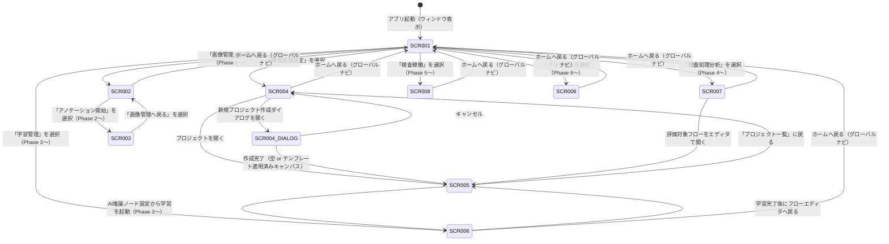

# 画面仕様書

## ドキュメント情報

| 項目             | 内容                                                                             |
| ---------------- | -------------------------------------------------------------------------------- |
| プロダクト名     | FlowInspect - ノードベース工場画像検査プラットフォーム（仮称）                   |
| 対象バージョン   | v1.0 (MVP)                                                                       |
| 作成日           | 2026-03-12                                                                       |
| 最終更新日       | 2026-03-12                                                                       |
| 参照ドキュメント | PRD (`docs/product-requirements.md`)、機能設計書 (`docs/functional-design.md`) |

---

## 画面一覧

| 画面ID  | 画面名             | 種別      | 概要                                                                   | 対応機能           | フェーズ    | 仕様ファイル               |
| ------- | ------------------ | --------- | ---------------------------------------------------------------------- | ------------------ | ----------- | -------------------------- |
| SCR-001 | ホーム画面         | メイン    | アプリ起動時の起点。主要機能エリアへのナビゲーションを提供する         | -                  | MVP         | `scr-001-home.md`          |
| SCR-002 | 画像管理画面       | メイン    | 画像データセットの一覧・画像ブラウズ・メタ情報編集                     | FN-004             | Post-MVP (Phase 1) | `scr-002-image-manager.md` |
| SCR-003 | アノテーション画面 | メイン    | 画像に対してAI学習用のアノテーションを付与する                         | FN-005             | Post-MVP (Phase 2) | `scr-003-annotation.md`    |
| SCR-004 | プロジェクト一覧画面 | メイン   | プロジェクトの一覧表示と作成・選択。作成時にテンプレート選択も可能     | FN-003, FN-009     | MVP         | `scr-004-project-list/wireframes.md`、`scr-004-project-list/behaviors.md` |
| SCR-005 | フローエディタ画面 | メイン    | 検査パイプラインをノードベースで設計するメイン画面                     | FN-001, FN-002, FN-007 | MVP    | `scr-005-flow-editor/wireframes.md`、`scr-005-flow-editor/behaviors.md` |
| SCR-006 | 学習管理画面       | メイン    | AIモデルの学習ジョブ管理・学習済みモデル管理                           | FN-006             | Post-MVP (Phase 3) | `scr-006-training.md`      |
| SCR-007 | 検査処理分析画面   | メイン    | テスト用データセットを使った検査フローの精度評価・可視化               | FN-008             | Post-MVP (Phase 4) | `scr-007-analysis.md`      |
| SCR-008 | 検査稼働画面       | メイン    | 現場オペレーター向けのシンプルな検査実行・結果確認画面                 | FN-010             | Post-MVP (Phase 5) | `scr-008-inspection.md`    |
| SCR-009 | クラウド画面       | メイン    | クラウド連携の有効化・接続設定・データ管理                             | FN-011             | Post-MVP (Phase 6) | `scr-009-cloud.md`         |

---

## 画面遷移図

> ※ 図内のステートIDはmermaid記法上の制約からハイフンを省略しています（例: SCR001 = SCR-001）。

### 画面遷移一覧

| #  | 遷移元                  | 遷移先                  | トリガー                                     | 遷移方法 | 備考                             |
| -- | ----------------------- | ----------------------- | -------------------------------------------- | -------- | -------------------------------- |
| 1  | 起動                    | SCR-001                 | アプリ起動（ウィンドウ表示）                 | initial  | 前回終了時の状態を復元           |
| 2  | SCR-001                 | SCR-004                 | 「検査処理設定」ナビゲーション項目をクリック | nav      | サイドナビの選択切り替え         |
| 3  | SCR-001                 | SCR-002                 | 「画像管理」ナビゲーション項目をクリック     | nav      | Phase 1〜。無効時はグレーアウト  |
| 4  | SCR-001                 | SCR-006                 | 「学習管理」ナビゲーション項目をクリック     | nav      | Phase 3〜。無効時はグレーアウト  |
| 5  | SCR-001                 | SCR-007                 | 「検査処理分析」ナビゲーション項目をクリック | nav      | Phase 4〜。無効時はグレーアウト  |
| 6  | SCR-001                 | SCR-008                 | 「検査稼働」ナビゲーション項目をクリック     | nav      | Phase 5〜。無効時はグレーアウト  |
| 7  | SCR-001                 | SCR-009                 | 「クラウド」ナビゲーション項目をクリック     | nav      | Phase 6〜。無効時はグレーアウト  |
| 8  | SCR-004                 | SCR-001                 | グローバルナビの「ホーム」をクリック         | nav      |                                  |
| 9  | SCR-004                 | SCR-005                 | プロジェクトカードをダブルクリック           | push     | 既存プロジェクトを開く           |
| 10 | SCR-004                 | SCR-004（作成ダイアログ）| 「新規プロジェクト作成」ボタンをクリック     | modal    | プロジェクト名・テンプレート選択（Phase 4〜）を含むダイアログ |
| 11 | SCR-004（作成ダイアログ）| SCR-005                 | ダイアログで「作成」をクリック               | modal閉→push | テンプレート未選択時は空のキャンバス、選択時はテンプレート適用済みキャンバスで開く |
| 12 | SCR-004（作成ダイアログ）| SCR-004                 | ダイアログで「キャンセル」をクリック         | modal閉  |                                  |
| 13 | SCR-005                 | SCR-004                 | ヘッダーの「プロジェクト一覧」をクリック     | pop      |                                  |
| 14 | SCR-005                 | SCR-006                 | AI推論ノードの設定から「学習を開始」をクリック | push   | Phase 3〜。学習管理画面へ遷移    |
| 15 | SCR-006                 | SCR-005                 | 学習完了後に「フローエディタへ戻る」をクリック | pop    | 遷移元がSCR-005の場合のみ        |
| 16 | SCR-002                 | SCR-001                 | グローバルナビの「ホーム」をクリック         | nav      |                                  |
| 17 | SCR-002                 | SCR-003                 | 「アノテーション開始」ボタンをクリック       | push     | Phase 2〜                        |
| 18 | SCR-003                 | SCR-002                 | ヘッダーの「画像管理へ戻る」をクリック       | pop      |                                  |
| 19 | SCR-006                 | SCR-001                 | グローバルナビの「ホーム」をクリック         | nav      |                                  |
| 20 | SCR-007                 | SCR-001                 | グローバルナビの「ホーム」をクリック         | nav      |                                  |
| 21 | SCR-007                 | SCR-005                 | 評価対象フローの「エディタで開く」をクリック | push     |                                  |
| 22 | SCR-008                 | SCR-001                 | グローバルナビの「ホーム」をクリック         | nav      |                                  |
| 23 | SCR-009                 | SCR-001                 | グローバルナビの「ホーム」をクリック         | nav      |                                  |

> ※ テンプレートの「アニメーション」列はデスクトップアプリのため省略し、「備考」列に統合しています。UIフレームワーク選定後にアニメーション仕様が必要な場合は列を追加します。

---

## 共通挙動仕様

### アプリライフサイクル

| イベント                     | 挙動                                                                                         |
| ---------------------------- | -------------------------------------------------------------------------------------------- |
| コールドスタート             | スプラッシュ表示後、前回終了時の画面状態を復元して起動する。前回状態がない場合はホーム画面（SCR-001）を表示する |
| ウィンドウ最小化             | バックグラウンドで動作継続。進行中の処理（学習・評価等）は停止しない                        |
| ウィンドウ復元               | 最小化前の画面状態をそのまま表示する                                                         |
| ウィンドウを閉じる（×ボタン） | 未保存のフロー設定がある場合は保存確認ダイアログを表示する。保存済みまたは確認後にアプリを終了する |
| アプリクラッシュ             | クラッシュ前の自動保存データから状態を復元する。復元データがない場合はホーム画面で起動する   |
| クラッシュリカバリー         | 次回起動時にリカバリーダイアログを表示し、自動保存データから復元するか新規起動かを選択できる |
| OSシャットダウン/再起動      | アプリ終了時と同様の手順で保存確認を行い、正常終了する                                       |

### エラーハンドリング共通仕様

| エラー種別             | 表示方法           | ユーザーへの表示                                                           | 自動リトライ |
| ---------------------- | ------------------ | -------------------------------------------------------------------------- | ------------ |
| ファイルI/Oエラー      | ウィンドウ内トースト | 「ファイルの読み書きに失敗しました。ディスク容量またはアクセス権限を確認してください」 | なし         |
| ストレージ不足         | モーダルダイアログ | 「ディスク容量が不足しています。不要なファイルを削除してから再試行してください」 | なし         |
| フロー実行エラー       | インラインエラー表示（ノード上） | 「[ノード名] でエラーが発生しました: [エラー詳細]」                   | なし         |
| 画像読み込みエラー     | ウィンドウ内トースト | 「画像ファイルを読み込めませんでした。対応フォーマット（JPEG/PNG/BMP）か確認してください」 | なし         |
| GPU未検出              | ウィンドウ内トースト | 「GPUが検出されません。AI推論・学習機能は利用できません」               | なし         |
| アプリ内部エラー       | モーダルダイアログ | 「予期しないエラーが発生しました。アプリを再起動してください（エラーコード: [code]）」 | なし         |
| ネットワークエラー（クラウド連携時のみ） | ウィンドウ内トースト | 「クラウドへの接続に失敗しました。ネットワーク接続を確認してください」 | 3回まで自動リトライ |

> 基本動作はオフライン。ネットワークエラーはクラウド連携（Phase 6）が有効な場合のみ発生する。

### アプリ固有の共通仕様

| 項目                         | 仕様                                                                                                        |
| ---------------------------- | ----------------------------------------------------------------------------------------------------------- |
| フロー設定の自動保存         | フローエディタ（SCR-005）でノードの追加・削除・接続・パラメータ変更が行われるたびに、30秒以内に自動保存する。手動保存ボタンでも即時保存できる |
| フロー設定の保存形式         | ローカルのプロジェクトフォルダにJSONファイルとして保存する。クラウド連携を有効化するまでローカルにのみ保存される |
| 検査結果のローカル保存       | 検査稼働画面（SCR-008）での検査実行結果（判定結果・入力画像サムネイル・タイムスタンプ）はローカルDBに自動保存する |
| 処理の再現性保証             | 同一のフロー設定・同一の入力画像に対して常に同一の結果を返す（乱数シード固定等による再現性100%） |
| 未保存変更の保護             | フローエディタで未保存の変更がある状態でナビゲーション移動やウィンドウを閉じようとした場合、保存確認ダイアログを表示する |
| Post-MVP機能のナビゲーション | Phase 1〜6の機能に対応するナビゲーション項目はMVP時点でも表示するが、非活性（グレーアウト）状態で表示し、クリック時に「この機能は今後対応予定です」とツールチップ表示する |
| グローバルナビゲーション     | 全画面共通でサイドバー形式のグローバルナビゲーションを表示する。サイドバー最上部にはアプリロゴを配置する（閉状態：ロゴアイコンのみ、開状態：ロゴアイコン＋アプリ名「FlowInspect」）。SCR-002〜SCR-009では開状態で常時表示し、どの画面からでも主要エリアへ直接アクセスできる。ホーム画面（SCR-001）ではサイドバーは閉状態（アイコンのみ）で表示し、ホバー時にオーバーレイで展開する |

---

## 画面状態一覧

| 画面ID  | 画面名             | 初期状態 | 入力中 | データあり | 空状態 | エラー | ローディング |
| ------- | ------------------ | -------- | ------ | ---------- | ------ | ------ | ------------ |
| SCR-001 | ホーム画面         | あり     | -      | -          | -      | -      | -            |
| SCR-002 | 画像管理           | あり     | あり   | あり       | あり   | あり   | あり         |
| SCR-003 | アノテーション     | あり     | あり   | あり       | -      | あり   | -            |
| SCR-004 | プロジェクト一覧   | あり     | あり   | あり       | あり   | あり   | あり         |
| SCR-005 | フローエディタ     | あり     | あり   | あり       | あり   | あり   | あり         |
| SCR-006 | 学習管理           | あり     | あり   | あり       | あり   | あり   | あり         |
| SCR-007 | 検査処理分析       | あり     | あり   | あり       | あり   | あり   | あり         |
| SCR-008 | 検査稼働           | あり     | -      | あり       | -      | あり   | あり         |
| SCR-009 | クラウド           | あり     | あり   | あり       | -      | あり   | あり         |

> 「初期状態」: 画面初回表示時の状態
> 「入力中」: ユーザーがフォームや検索条件を入力している状態
> 「データあり」: リスト・グリッド等にデータが表示されている状態
> 「空状態」: データが0件の状態（空のプロジェクト一覧など）
> 「エラー」: 操作または処理によりエラーが発生した状態
> 「ローディング」: データ取得・処理実行中の状態
> 「-」: その画面では該当しない状態
> ※ SCR-003（アノテーション画面）の空状態・ローディングが該当しない理由: アノテーション画面は必ず1枚以上の画像を選択した状態でSCR-002から遷移するため、データが0件の状態は発生しない。また画像データはローカルに保持済みのため非同期読み込みのローディング状態も発生しない。

---

## PRD機能要件との対応表

| PRD機能要件                                  | 優先度 | 対応機能 | 対応画面   | 主な操作                                                       |
| -------------------------------------------- | ------ | -------- | ---------- | -------------------------------------------------------------- |
| ノードベースフローエディタ                   | P0     | FN-001   | SCR-005    | ノード配置・接続・パラメータ設定・フロー実行（デバッグ）       |
| 従来型画像処理ノード群                       | P0     | FN-002   | SCR-005    | ノードパレットからの前処理・特徴抽出・判定ノードの配置         |
| プロジェクト管理（フローエディタの前提）     | -      | FN-003   | SCR-004, SCR-005 | プロジェクト作成・一覧・選択・切り替え                    |
| 画像アセット管理（Phase 1）                  | P1     | FN-004   | SCR-002    | 画像インポート・データセット管理・タグ付け・フィルタリング     |
| アノテーション機能（Phase 2）                | P1     | FN-005   | SCR-003    | 分類・バウンディングボックス・セグメンテーションアノテーション |
| AI学習機能（Phase 3）                        | P1     | FN-006   | SCR-006    | 学習設定・実行・進捗確認・モデル管理                           |
| AI推論ノード群（Phase 3）                    | P1     | FN-007   | SCR-005    | AI推論ノードの配置・学習済みモデルの選択                       |
| 画像処理フロー評価機能（Phase 4）            | P1     | FN-008   | SCR-007    | 評価実行・混同行列確認・精度指標確認・個別画像結果確認         |
| テンプレート機能（Phase 4）                  | P1     | FN-009   | SCR-004    | プロジェクト作成ダイアログ内でテンプレート選択・フロー適用     |
| 検査実行画面（Phase 5）                      | P1     | FN-010   | SCR-008    | 検査フロー選択・画像入力・判定結果確認・検査履歴確認           |
| クラウド連携（Phase 6）                      | P2     | FN-011   | SCR-009    | クラウド有効化・データアップロード・クラウド学習実行           |

---

## 非機能要件との対応

| 非機能要件                           | 対応する画面・仕様                                                                        |
| ------------------------------------ | ----------------------------------------------------------------------------------------- |
| フロー編集レスポンス 200ms以内       | SCR-005: ノード追加・接続・パラメータ変更操作への即時応答                                 |
| フロー設定の保全（クラッシュ時）     | 共通挙動仕様「フロー設定の自動保存」「クラッシュリカバリー」                              |
| 検査結果の再現性 100%                | 共通挙動仕様「処理の再現性保証」                                                          |
| データのローカル保管                 | 共通挙動仕様「フロー設定の保存形式」「検査結果のローカル保存」                            |
| 50ノード以上のフロー設計・実行       | SCR-005: キャンバスのズーム・パン機能によるスケーラブルなフロー設計                      |
| フロー評価の完了時間 100枚・5分以内  | SCR-007: 評価実行時のローディング表示・進捗表示                                           |
| 基本操作習得時間 30分以内            | 全画面共通: 直感的なUI設計・ツールチップ・ガイドの提供。各画面の詳細は個別画面仕様に記載   |
| テンプレート活用時の習得時間 60分以内 | SCR-004: プロジェクト作成ダイアログ内のテンプレート選択・説明・ガイド表示                  |
| オペレーターが教育なしで操作可能     | SCR-008: シンプルな大画面レイアウトで直感的な操作性を提供                                 |
